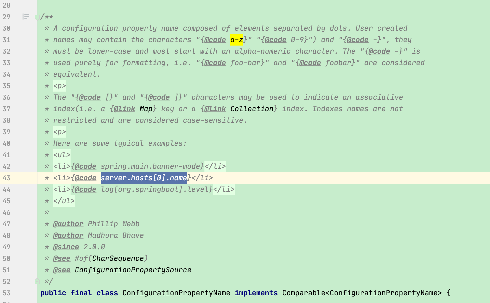
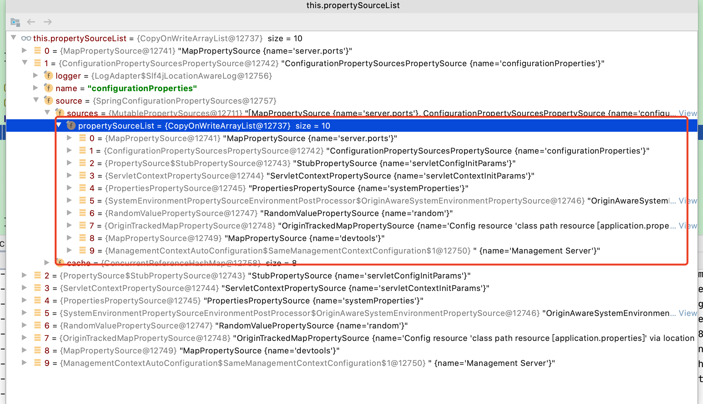

# Environment对象解读

[toc]

本文以Spring boot中对Environment对象的使用作为切入点，理解Environment对象。在Springboot中默认使用的Environment对象为ApplicationServletEnvironment，类图为：


## ApplicationServletEnvironment
在拉起对象ApplicationServletEnvironment对象，继承自AbstractEnvironment对象，会调用AbstractEnvironment的构造方法。AbstractEnvironment中有方法`getPropertySources`用来获取存入的MutablePropertySources对象
```java
	public AbstractEnvironment() {
		this(new MutablePropertySources());
	}

	protected AbstractEnvironment(MutablePropertySources propertySources) {
		this.propertySources = propertySources;
		this.propertyResolver = createPropertyResolver(propertySources);
		customizePropertySources(propertySources);
	}
```
在构造方法中，将propertySources与propertyResolver使用对象MutablePropertySources进行了初始化。MutablePropertySources为AbstractEnvironment的默认存储组件。还提供了一个非常重要的方法customizePropertySources供子类实现，像实现这个类的对象，提供了propertySources属性，可以customize的往propertySources中添加/移除对象，自定义加入对象的优先级。StandardServletEnvironment重写了customizePropertySources方法，往对象中加入了servletConfigInitParams/servletContextInitParams属性。

```java
	@Override
	protected void customizePropertySources(MutablePropertySources propertySources) {
		propertySources.addLast(new StubPropertySource(SERVLET_CONFIG_PROPERTY_SOURCE_NAME));
		propertySources.addLast(new StubPropertySource(SERVLET_CONTEXT_PROPERTY_SOURCE_NAME));
		if (jndiPresent && JndiLocatorDelegate.isDefaultJndiEnvironmentAvailable()) {
			propertySources.addLast(new JndiPropertySource(JNDI_PROPERTY_SOURCE_NAME));
		}
		super.customizePropertySources(propertySources);
	}
```
StandardEnvironment也重写了customizePropertySources方法，添加了systemProperties与systemEnvironment属性，值为map。
```java
	@Override
	protected void customizePropertySources(MutablePropertySources propertySources) {
		propertySources.addLast(
				new PropertiesPropertySource(SYSTEM_PROPERTIES_PROPERTY_SOURCE_NAME, getSystemProperties()));
		propertySources.addLast(
				new SystemEnvironmentPropertySource(SYSTEM_ENVIRONMENT_PROPERTY_SOURCE_NAME, getSystemEnvironment()));
	}
```
到此ApplicationServletEnvironment初始化完成。


## MutablePropertySources


MutablePropertySources的使用的设计模式组合模式，为透明式组合模式的结构。Iterable存的是PropertySource。

### PropertySource
PropertySource为抽象构件角色类，主要提供了getProperty方法，给子类实现：
```java
public abstract class PropertySource<T> {

	protected final Log logger = LogFactory.getLog(getClass());

	/**
	 * PropertySource的名称属性，提供了get方法，set只能通过构造方法设置
	 */
	protected final String name;

	/**
	 * PropertySource source属性，提供了get方法，set只能通过构造方法设置
	 */
	protected final T source;


	/**
	 * 使用给定的名称和源对象创建一个新的 {@code PropertySource}。
	 * @param name the associated name
	 * @param source the source object
	 */
	public PropertySource(String name, T source) {
		Assert.hasText(name, "Property source name must contain at least one character");
		Assert.notNull(source, "Property source must not be null");
		this.name = name;
		this.source = source;
	}
	/**
	 *返回此 {@code PropertySource} 对象的名称。
	 */
	public String getName() {
		return this.name;
	}

	/**
	 * 返回此 {@code PropertySource} 的source。
	 */
	public T getSource() {
		return this.source;
	}

	/**
	 * 返回此 {@code PropertySource} 是否包含给定名称。
	 * <p>此实现仅检查来自 {@link #getProperty(String)} 的 {@code null} 返回值。
	 * 如果可能，子类可能希望实现更有效的算法。
	 * @param name the property name to find
	 */
	public boolean containsProperty(String name) {
		return (getProperty(name) != null);
	}

	/**
	 * 返回与给定名称关联的值，如果未找到，则返回 {@code null}。
	 * 聚集管理的方法，交给子类实现
	 * @param name the property to find
	 * @see PropertyResolver#getRequiredProperty(String)
	 */
	@Nullable
	public abstract Object getProperty(String name);
}
```
### PropertySources

PropertySources添加了三个方法，用来管理存储对象中包含的子构件对象PropertySource，只有三个方法：
- stream():
- contains(String name):
- get(String name):


```java
public interface PropertySources extends Iterable<PropertySource<?>> {

	/**
	 * 返回一个流对象
	 * @since 5.1
	 */
	default Stream<PropertySource<?>> stream() {
		return StreamSupport.stream(spliterator(), false);
	}

	/**
	 * 返回是否包含具有给定名称的属性源。
	 * @param name the {@linkplain PropertySource#getName() name of the property source} to find
	 */
	boolean contains(String name);

	/**
	 *返回具有给定名称的属性源，如果未找到，则返回 {@code null}。
	 * @param name the {@linkplain PropertySource#getName() name of the property source} to find
	 */
	@Nullable
	PropertySource<?> get(String name);

}
```


### MutablePropertySources

MutablePropertySources类管理了一整个Spring容器的所有属性，所有的属性都存储在propertySourceList中。MutablePropertySources类主要提供了propertySourceList的增删改查。

```java
public class MutablePropertySources implements PropertySources {

	/**
	 * 用来存储对象中包含的子构件对象PropertySource，管理全局的PropertySource属性
	 */
	private final List<PropertySource<?>> propertySourceList = new CopyOnWriteArrayList<>();


	/**
	 * Create a new {@link MutablePropertySources} object.
	 */
	public MutablePropertySources() {
	}

	/**
	 * 从给定的 propertySources 对象创建一个新的 {@code MutablePropertySources}，保留包含的 {@code PropertySource} 对象的原始顺序。
	 */
	public MutablePropertySources(PropertySources propertySources) {
		this();
		for (PropertySource<?> propertySource : propertySources) {
			//在最后添加一个propertySource属性
			addLast(propertySource);
		}
	}

	@Override
	public boolean contains(String name) {
		for (PropertySource<?> propertySource : this.propertySourceList) {
			if (propertySource.getName().equals(name)) {
				return true;
			}
		}
		return false;
	}

	@Override
	@Nullable
	public PropertySource<?> get(String name) {
		for (PropertySource<?> propertySource : this.propertySourceList) {
			if (propertySource.getName().equals(name)) {
				return propertySource;
			}
		}
		return null;
	}


	/**
	 * 添加具有最高优先级的给定属性源对象。添加到0索引位置
	 */
	public void addFirst(PropertySource<?> propertySource) {
		synchronized (this.propertySourceList) {
			removeIfPresent(propertySource);
			this.propertySourceList.add(0, propertySource);
		}
	}

	/**
	 * 添加元素到propertySourceList最后一位
	 */
	public void addLast(PropertySource<?> propertySource) {
		synchronized (this.propertySourceList) {
			removeIfPresent(propertySource);
			this.propertySourceList.add(propertySource);
		}
	}

    ....

}
```
## 属性获取

获取属性的核心方法在ConfigurationPropertySourcesPropertySource中，如下:
```java
class ConfigurationPropertySourcesPropertySource extends PropertySource<Iterable<ConfigurationPropertySource>>
		implements OriginLookup<String> {
.......
	ConfigurationProperty findConfigurationProperty(ConfigurationPropertyName name) {
		if (name == null) {
			return null;
		}
		for (ConfigurationPropertySource configurationPropertySource : getSource()) {
			ConfigurationProperty configurationProperty = configurationPropertySource.getConfigurationProperty(name);
			if (configurationProperty != null) {
				return configurationProperty;
			}
		}
		return null;
	}
.......
}
```
主要的功能在 getSource()方法，ConfigurationPropertySourcesPropertySource存的是ConfigurationPropertySource，默认实现为SpringConfigurationPropertySource，在调用SpringConfigurationPropertySource的迭代器的时候，会执行如下方法，传递一个adapt lambda方法，调用迭代器的hasNext的时候，会调用adapt，获取单个propertySources的所有属性，然后从单个propertySources中获取是否存在需要获取的属性配置，获取到了就返回，否则继续拿出下一个propertySources查询值是否在其中。

```java
	@Override
	public Iterator<ConfigurationPropertySource> iterator() {
		return new SourcesIterator(this.sources.iterator(), this::adapt);
	}

	private ConfigurationPropertySource adapt(PropertySource<?> source) {
		ConfigurationPropertySource result = this.cache.get(source);
		// Most PropertySources test equality only using the source name, so we need to
		// check the actual source hasn't also changed.
		if (result != null && result.getUnderlyingSource() == source) {
			return result;
		}
		result = SpringConfigurationPropertySource.from(source);
		if (source instanceof OriginLookup) {
			result = result.withPrefix(((OriginLookup<?>) source).getPrefix());
		}
		this.cache.put(source, result);
		return result;
	}    

		private ConfigurationPropertySource fetchNext() {
			if (this.next == null) {
				if (this.iterators.isEmpty()) {
					return null;
				}
				if (!this.iterators.peek().hasNext()) {
					this.iterators.pop();
					return fetchNext();
				}
				PropertySource<?> candidate = this.iterators.peek().next();
				if (candidate.getSource() instanceof ConfigurableEnvironment) {
					push((ConfigurableEnvironment) candidate.getSource());
					return fetchNext();
				}
				if (isIgnored(candidate)) {
					return fetchNext();
				}
				this.next = this.adapter.apply(candidate);
			}
			return this.next;
		}    
    
```

## ConfigurationPropertyName属性配置使用
在Springboot中，我们获取属性的方式有多种。
- @Value
- @ConfigurationProperties
- Environment对象中获取
- 直接InputStream获取

比较推荐的是使用@Value/@ConfigurationProperties的方式去获取属性。那对于属性的配置，有没有什么限制呢？Springboot对我们定义的属性名称是怎么解析的呢？这块代码写在ConfigurationPropertyName类中。ConfigurationPropertyName的doc清晰的描述了我们配置属性的名称规范：


翻译过来：
- 由点分隔的元素组成的配置属性名称。 
- 用户创建的名称可以包含字符“ a-z”，“ 0-9”）和“-”，它们必须为小写字母，并且必须以字母数字字符开头。 “-”仅用于格式化，即“ foo-bar”和“ foobar”被认为是等效的。
- [和]字符可用于表示关联索引（即Map键或Collection索引。索引名称不受限制，并且区分大小写。以下是一些典型示例：
    - spring.main.banner-mode  
    - server.hosts [0].name 
    - log[org.springboot] .level
    - []与{}代表的是，ConfigurationPropertyName可以解析对象


### ConfigurationPropertyName配置示例

Springboot的@ConfigurationProperties支持的配置有：
- 普通属性
    - 普通String/Integer/boolean
```yml
prop:
  normalboolean: false
  normalnumber: 123
  normalstring: value1
```
- 数组或集合(元素为简单的元素)
```yml
prop:
  myListOrArray:
    - a
    - b
    - c
```
- 数组或集合(元素为对象)
```yml
prop:
  myListOrArrayPlus:
    - {age: 25,
       gender: 男,
       name: 张三
    }
    - {age: 25,
       gender: 男,
       name: 李四
    }
```
- 简单map
```yml
prop:
  mymap:
    k1: v1
    k2: v2
    k3: v3
```
- 复杂map(值为一个对象)
```yml
  myMapPlus:
    k1: {
      age: 25,
      gender: 男,
      name: 张三
    }
    k2: {
      age: 25,
      gender: 男,
      name: 王五
    }
```

#### 引入dependency
```xml
    <dependency>
      <groupId>org.springframework.boot</groupId>
      <artifactId>spring-boot-configuration-processor</artifactId>
    </dependency>
```
#### properties.yml配置

```yml
prop:
  #------------------------------------------------------------- 普通用法
  # 普通属性
  normalboolean: false
  normalnumber: 123
  normalstring: value1

  #------------------------------------------------------------- 数组/集合
  # 数组或集合(元素为简单的元素)
  myListOrArray:
    - a
    - b
    - c
  ### 等价于
  #myListOrArray: a, b, c

  # 数组或集合(元素为对象)
  myListOrArrayPlus:
    - {age: 25,
       gender: 男,
       name: 张三
    }
    - {age: 25,
       gender: 男,
       name: 李四
    }
  ### 等价于
  #myListOrArrayPlus:
  #  -   age: 25
  #      gender: 男
  #      name: 张三
  #  -   age: 25
  #      gender: 男
  #      name: 李四

  #------------------------------------------------------------- Map
  ### 简单map
  mymap:
    k1: v1
    k2: v2
    k3: v3
  ### 等价于
  #mymap[k1]: v1
  #mymap[k2]: v2
  #mymap[k3]: v3

  ### 复杂map(值为一个对象)
  # 提示: {xxx}可以写在一行，也可以换行， 如本人这里换行了
  myMapPlus:
    k1: {
      age: 25,
      gender: 男,
      name: 张三
    }
    k2: {
      age: 25,
      gender: 男,
      name: 王五
    }
  ### 等价于
  #myMapPlus[k1]:
  #  age: 25
  #  gender: 男
  #  name: 张三
  #myMapPlus[k2]:
  #  age: 25
  #  gender: 男
  #  name: 王五

  #------------------------------------------------------------- 对象
  # 提示: {xxx}可以写在一行，也可以换行， 如本人这里就直接写在一行了
  myuser: {age: 25, gender: 男, name: 张三}
  ### 等价于
  #myuser:
  #  age: 25
  #  gender: 男
  #  name: 张三
  ```
#### 配置类
```java
@ConfigurationProperties(prefix = "prop")
@Component
public class MyConfig {


    private String normalString;

    private Integer normalNumber;

    private Boolean normalBoolean;

    /** 这里类型采用数组或集合都可以 */
    private String[] myListOrArray;

    private Map<String, Object> myMap;

    private User myUser;

    /** 这里类型采用数组或集合都可以 */
    private List<User> myListOrArrayPlus;

    private Map<String, User> myMapPlus;

    /**
     * 注:此方法不是必须的
     *
     * 虽然此类已经注入了Spring容器中了，但是有时我们为了方便直接获取到属性，
     * 我们可以通过类似以下的方式，将某个属性注入到容器中；
     * 获取时，形如
     *     @Autowired
     *     @Qualifier("initInfoMap")
     *     private Map<String, User> initInfoMap;
     * 这样获取就行
     *
     * @date 2019/6/3 14:48
     */
    @Bean(name = "initInfoMap")
    private Map<String, User> initMap(){
        return this.myMapPlus;
    }

    public String getNormalString() {
        return normalString;
    }

    public void setNormalString(String normalString) {
        this.normalString = normalString;
    }

    public Integer getNormalNumber() {
        return normalNumber;
    }

    public void setNormalNumber(Integer normalNumber) {
        this.normalNumber = normalNumber;
    }

    public Boolean getNormalBoolean() {
        return normalBoolean;
    }

    public void setNormalBoolean(Boolean normalBoolean) {
        this.normalBoolean = normalBoolean;
    }

    public String[] getMyListOrArray() {
        return myListOrArray;
    }

    public void setMyListOrArray(String[] myListOrArray) {
        this.myListOrArray = myListOrArray;
    }

    public Map<String, Object> getMyMap() {
        return myMap;
    }

    public void setMyMap(Map<String, Object> myMap) {
        this.myMap = myMap;
    }

    public User getMyUser() {
        return myUser;
    }

    public void setMyUser(User myUser) {
        this.myUser = myUser;
    }

    public List<User> getMyListOrArrayPlus() {
        return myListOrArrayPlus;
    }

    public void setMyListOrArrayPlus(List<User> myListOrArrayPlus) {
        this.myListOrArrayPlus = myListOrArrayPlus;
    }

    public Map<String, User> getMyMapPlus() {
        return myMapPlus;
    }

    public void setMyMapPlus(Map<String, User> myMapPlus) {
        this.myMapPlus = myMapPlus;
    }

    @Override
    public String toString() {
        return "MyConfig{" +
                "normalString='" + normalString + '\'' +
                ", normalNumber=" + normalNumber +
                ", normalBoolean=" + normalBoolean +
                ", myListOrArray=" + Arrays.toString(myListOrArray) +
                ", myMap=" + myMap +
                ", myUser=" + myUser.getName()+"/"+myUser.getGender()+"/"+myUser.getAge()+"/" +
                ", myListOrArrayPlus=" + myListOrArrayPlus +
                ", myMapPlus=" + myMapPlus +
                '}';
    }
}
```

#### 测试类
```java
@SpringBootTest
class PetclinicIntegrationTests {

	@Autowired
	private VetRepository vets;

	@Autowired
	private MyConfig myConfig;

	@Test
	void testFindAll() throws Exception {
//		vets.findAll();
		System.out.println(myConfig);
	}
}
```

## 总结
最初的Spring中，对于environment的封装是非常简单的一个组合类，MutablePropertySources implements PropertySources<PropertySource>，PropertySource为非常简单的name/value 形式的类，在MutablePropertySources中声明一个list，用来存储系统中所有的PropertySource

```java
public class MutablePropertySources implements PropertySources {

	/**
	 * 用来存储对象中包含的子构件对象PropertySource，管理全局的PropertySource属性
	 */
	private final List<PropertySource<?>> propertySourceList = new CopyOnWriteArrayList<>();
 }
```

Springboot对他做了attach的适配，为了封装多套的MutablePropertySources，然后用ConfigurationPropertySourcesPropertySource将他们合起来

Springboot在进入查询属性值的时候，会一个一个属性中去查找，先找到就先退出来，为了兼容多套的MutablePropertySources。
PropertySource之所以用组合，可以从组合的定义中看出来：
>属于对象的结构模式，有时又叫做“部分——整体”模式。组合模式将对象组织到树结构中，可以用来描述整体和部分的关系。组合模式可以使客户端将单纯元素与复合元素同等看待。

所以MutablePropertySources中存的PropertySource，value可以是任意值，map/对象/string，我们只需要经过组合提供的客户端方法，就可以操作所有属性。