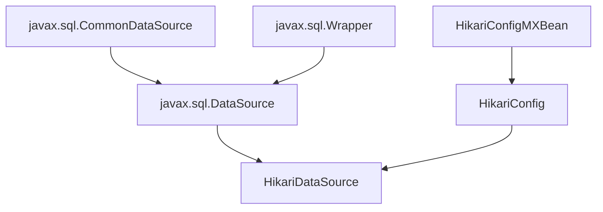

# HikariCP连接池源码阅读

[toc]

## Github

https://github.com/brettwooldridge/HikariCP

## 测试代码

使用springboot进行测试，springboot默认使用Hikari连接池

```xml
<dependency>
    <groupId>org.springframework.boot</groupId>
    <artifactId>spring-boot-starter-jdbc</artifactId>
</dependency>
```

```java
public class HarikaTest {
    public static void main(String[] args) throws Exception{
        HikariDataSource ds = new HikariDataSource();
        ds.setJdbcUrl("jdbc:mysql://10.36.36.225:3322/mmm");
        ds.setDriverClassName("com.mysql.cj.jdbc.Driver");
        ds.setUsername("dev");
        ds.setPassword("123");
        Connection connection = ds.getConnection();
        Statement statement = connection.createStatement();
        ResultSet resultSet = statement.executeQuery("select * from user limit 1 ");
        while (resultSet.next()){
            String id = resultSet.getString("id");
        }
        System.out.println("1");
    }
}
```

## 连接池的作用

字面理解，就是管理mysql的连接，**那么什么是mysql的连接呢**？个人理解，就是如下包的代码，交给连接池去调度(初始化/应用等)，所以我们在引入例如Harika/Druid等连接池后，还需要引入特定的connector，然后将Driver注册给DriverManager静态类管理

```xml
<!----各种数据库的连接，交由连接池管理/调度------>
<dependency>
    <groupId>mysql</groupId>
    <artifactId>mysql-connector-java</artifactId>
</dependency>
```

## 注册Driver

在我们初始化mysql连接时，通常需要如下2个代码，在springboot中，可以无需配置driver-class-name，其会通过url截取进行判断，那么为什么我们指定了Driver后，后续的代码就会走到我们指定的Connector呢？

```properties
spring.datasource.driver-class-name=com.mysql.cj.jdbc.Driver
spring.datasource.url=jdbc:mysql://10.36.36.225:3322
```

- HikariDataSource.setDriverClassName("com.mysql.cj.jdbc.Driver")代码会通过反射，创建其实例
- 示例化完成com.mysql.cj.jdbc.Driver后，会执行java.sql.DriverManager.registerDriver(new Driver());，将其加入DriverManager的管理，具体见如下doc


### java.sql.DriverManager

DriverManager是一个不让外部初始化的静态类，用于管理系统所有的java.sql.Driver，将其注册到registeredDrivers

- 注意一般只用DriverManager来管理Driver，而不用来获取connect，获取connect应该以实现javax.sql.DataSource，然后与DriverManager结合使用


### javax.sql.DataSource

重写javax.sql.DataSource，先初始化Driver，进行存储，后续使用driver.connect()获取数据库链接，并进行后续操作


## HikariDataSource



### 初始化分析

初始化分析主要有两部分工作，一是校验配置并且会矫正不符合规范的配置；二是实例化 Hikari 连接池。

```java
public HikariDataSource(HikariConfig configuration)
   {
      // 1、校验配置 并 矫正配置
      configuration.validate();
      configuration.copyStateTo(this);

      LOGGER.info("{} - Starting...", configuration.getPoolName());
      // 2、创建连接池，注意这里设置了 fastPathPool 
      pool = fastPathPool = new HikariPool(this);
      LOGGER.info("{} - Start completed.", configuration.getPoolName());

      this.seal();
   }
```

#### 矫正配置

校验配置会直接抛异常，**大部分坑来源于矫正配置这一步**，这会使你的配置不生效。

```java
private void validateNumerics() {
      // maxLifetime 链接最大存活时间最低30秒，小于30秒不生效
      if (maxLifetime != 0 && maxLifetime < SECONDS.toMillis(30)) {
         LOGGER.warn("{} - maxLifetime is less than 30000ms, setting to default {}ms.", poolName, MAX_LIFETIME);
         maxLifetime = MAX_LIFETIME;
      }
      // idleTimeout 空闲超时不能大于或者接近 maxLifetime，否则设置 0，禁用空闲线程回收
      if (idleTimeout + SECONDS.toMillis(1) > maxLifetime && maxLifetime > 0) {
         LOGGER.warn("{} - idleTimeout is close to or more than maxLifetime, disabling it.", poolName);
         idleTimeout = 0;
      }
      // idleTimeout 空闲超时不能低于默认值 10 秒
      if (idleTimeout != 0 && idleTimeout < SECONDS.toMillis(10)) {
         LOGGER.warn("{} - idleTimeout is less than 10000ms, setting to default {}ms.", poolName, IDLE_TIMEOUT);
         idleTimeout = IDLE_TIMEOUT;
      }
      // 连接泄露检测的时间，默认 0 不开启，不能低于 2 秒，不能比 maxLifetime 大，否则不开启
      if (leakDetectionThreshold > 0 && !unitTest) {
         if (leakDetectionThreshold < SECONDS.toMillis(2) || (leakDetectionThreshold > maxLifetime && maxLifetime > 0)) {
            LOGGER.warn("{} - leakDetectionThreshold is less than 2000ms or more than maxLifetime, disabling it.", poolName);
            leakDetectionThreshold = 0;
         }
      }
      // 从连接池获取连接时最大等待时间，默认值 30 秒, 低于 250 毫秒不生效
      if (connectionTimeout < 250) {
         LOGGER.warn("{} - connectionTimeout is less than 250ms, setting to {}ms.", poolName, CONNECTION_TIMEOUT);
         connectionTimeout = CONNECTION_TIMEOUT;
      }
      // 检测连接是否有效的超时时间，默认 5 秒，低于 250 毫秒不生效
      if (validationTimeout < 250) {
         LOGGER.warn("{} - validationTimeout is less than 250ms, setting to {}ms.", poolName, VALIDATION_TIMEOUT);
         validationTimeout = VALIDATION_TIMEOUT;
      }
      // 连接池中连接的最大数量，minIdle 大于 0 与其保持一致，否则默认 10
      if (maxPoolSize < 1) {
         maxPoolSize = (minIdle <= 0) ? DEFAULT_POOL_SIZE : minIdle;
      }
      // 维持的最小连接数量，不配置默认等于 maxPoolSize
      if (minIdle < 0 || minIdle > maxPoolSize) {
         minIdle = maxPoolSize;
      }
   }
```

#### 创建连接池

通过分析连接池实例化过程，可以看到 Hikari 的作者是多么喜欢用异步操作了

- 空闲线程处理
- 添加连接
- 关闭连接
- 连接泄露检测等

这一步会创建 1 个 LinkedBlockQueue 阻塞队列，需要明确的是，这个队列并不是实际连接池的队列， 只是用来放置添加连接的请求。

```java
public HikariPool(final HikariConfig config)
   {
      super(config);
      // 创建 ConcurrentBag 管理连接池，有连接池的四个重要操作：borrow获取连接，requite归还连接，add添加连接，remove移除连接。
      this.connectionBag = new ConcurrentBag<>(this);
      // getConnection 获取连接时的并发控制，默认关闭
      this.suspendResumeLock = config.isAllowPoolSuspension() ? new SuspendResumeLock() : SuspendResumeLock.FAUX_LOCK;
      // 空闲线程池 处理定时任务
      this.houseKeepingExecutorService = initializeHouseKeepingExecutorService();
      // 快速预检查 创建1个链接
      checkFailFast();
      // Metrics 监控收集相关
      if (config.getMetricsTrackerFactory() != null) {
         setMetricsTrackerFactory(config.getMetricsTrackerFactory());
      }
      else {
         setMetricRegistry(config.getMetricRegistry());
      }
      // 健康检查注册相关，默认 无
      setHealthCheckRegistry(config.getHealthCheckRegistry());
      // 处理JMX监控相关
      registerMBeans(this);

      ThreadFactory threadFactory = config.getThreadFactory();
      // 创建 maxPoolSize 大小的 LinkedBlockQueue 阻塞队列，用来构造 addConnectionExecutor
      LinkedBlockingQueue<Runnable> addConnectionQueue = new LinkedBlockingQueue<>(config.getMaximumPoolSize());
      // 镜像只读队列
      this.addConnectionQueue = unmodifiableCollection(addConnectionQueue);
      // 创建 添加连接的 线程池，实际线程数只有1，拒绝策略是丢弃不处理
      this.addConnectionExecutor = createThreadPoolExecutor(addConnectionQueue, poolName + " connection adder", threadFactory, new ThreadPoolExecutor.DiscardPolicy());
      // 创建 关闭连接的 线程池，实际线程数只有1，拒绝策略是调用线程同步执行
      this.closeConnectionExecutor = createThreadPoolExecutor(config.getMaximumPoolSize(), poolName + " connection closer", threadFactory, new ThreadPoolExecutor.CallerRunsPolicy());
      // 创建 检测连接泄露 的工厂，使用的时候只需要传1个连接对象
      this.leakTaskFactory = new ProxyLeakTaskFactory(config.getLeakDetectionThreshold(), houseKeepingExecutorService);
      // 延时100ms后，开启任务，每30s执行空闲线程处理
      this.houseKeeperTask = houseKeepingExecutorService.scheduleWithFixedDelay(new HouseKeeper(), 100L, HOUSEKEEPING_PERIOD_MS, MILLISECONDS);
   }
```

### 获取连接分析

Hikari 的连接获取分为两步

- 调用 connectionBag.borrow() 方法从池中获取连接，这里等待超时时间是 connectionTimeout
- 获取连接后，会主动检测连接是否可用，如果不可用会关闭连接，连接可用的话会绑定一个定时任务用于连接泄露的检测。

很多时候，会在异常日志中看到 Connection is not available 错误日志后携带的 request timed out 耗时远超 connectionTimeout，仔细分析源码这也是合理的。

```java
<HikariDataSource>
@Override
   public Connection getConnection() throws SQLException
   {
      if (isClosed()) {
         throw new SQLException("HikariDataSource " + this + " has been closed.");
      }
      if (fastPathPool != null) {
         return fastPathPool.getConnection();
      }

      // See http://en.wikipedia.org/wiki/Double-checked_locking#Usage_in_Java
      HikariPool result = pool;
                // 因为初始化 HikariDataSource 的时候已经设置了，所以这里直接走 return
      if (result == null) {
         synchronized (this) {
            result = pool;
            if (result == null) {
               validate();
               LOGGER.info("{} - Starting...", getPoolName());
               try {
                  pool = result = new HikariPool(this);
                  this.seal();
               }
               catch (PoolInitializationException pie) {
                  if (pie.getCause() instanceof SQLException) {
                     throw (SQLException) pie.getCause();
                  }
                  else {
                     throw pie;
                  }
               }
               LOGGER.info("{} - Start completed.", getPoolName());
            }
         }
      }

      return result.getConnection();
   }

<HikariPool>
  
   public Connection getConnection() throws SQLException
   {
      // 这里传了设置的链接超时
      return getConnection(connectionTimeout);
   }

   public Connection getConnection(final long hardTimeout) throws SQLException
   {
      suspendResumeLock.acquire(); // 并发数量控制，默认关闭
      final long startTime = currentTime();

      try {
         long timeout = hardTimeout;
         do {
            // 此处等待 connectionTimeout ，获取不到抛异常
            PoolEntry poolEntry = connectionBag.borrow(timeout, MILLISECONDS);
            if (poolEntry == null) {
               break; // We timed out... break and throw exception
            }
            
            final long now = currentTime();
            // 移除已经标记为废弃的连接 或者 空闲超过 500 毫秒且不可用的连接（超时时间是 validationTimeout，默认5秒）
            if (poolEntry.isMarkedEvicted() || (elapsedMillis(poolEntry.lastAccessed, now) > ALIVE_BYPASS_WINDOW_MS && !isConnectionAlive(poolEntry.connection))) {
               closeConnection(poolEntry, poolEntry.isMarkedEvicted() ? EVICTED_CONNECTION_MESSAGE : DEAD_CONNECTION_MESSAGE);
               timeout = hardTimeout - elapsedMillis(startTime);
            }
            else {
               metricsTracker.recordBorrowStats(poolEntry, startTime);
               // 先添加连接泄露检测任务，再通过Javassist创建代理连接
               return poolEntry.createProxyConnection(leakTaskFactory.schedule(poolEntry), now);
            }
         } while (timeout > 0L);

         metricsTracker.recordBorrowTimeoutStats(startTime);
         // 抛异常 Connection is not available, request timed out after {}ms.
         throw createTimeoutException(startTime);
      }
      catch (InterruptedException e) {
         Thread.currentThread().interrupt();
         throw new SQLException(poolName + " - Interrupted during connection acquisition", e);
      }
      finally {
         suspendResumeLock.release();
      }
   }
```

### 空闲连接回收

Hikari 在初始化连接池的时候，就已经开启了一条异步定时任务。该任务每 30 秒执行一次空闲连接回收，代码如下：

```java
/**
    * The house keeping task to retire and maintain minimum idle connections.
    * 用于补充和移除最小空闲连接的管理任务。
    */
   private final class HouseKeeper implements Runnable
   {
      private volatile long previous = plusMillis(currentTime(), -HOUSEKEEPING_PERIOD_MS);

      @Override
      public void run()
      {
         try {
            // refresh timeouts in case they changed via MBean
            connectionTimeout = config.getConnectionTimeout();
            validationTimeout = config.getValidationTimeout();
            leakTaskFactory.updateLeakDetectionThreshold(config.getLeakDetectionThreshold());

            final long idleTimeout = config.getIdleTimeout();
            final long now = currentTime();

            // Detect retrograde time, allowing +128ms as per NTP spec.
            // 为了防止时钟回拨，给了128ms的gap，正常情况下，ntp的校准回拨不会超过128ms
            // now = plusMillis(previous, HOUSEKEEPING_PERIOD_MS) + 100ms
            if (plusMillis(now, 128) < plusMillis(previous, HOUSEKEEPING_PERIOD_MS)) {
               LOGGER.warn("{} - Retrograde clock change detected (housekeeper delta={}), soft-evicting connections from pool.",
                           poolName, elapsedDisplayString(previous, now));
               previous = now;
               softEvictConnections();
               return;
            }
            else if (now > plusMillis(previous, (3 * HOUSEKEEPING_PERIOD_MS) / 2)) {
               // No point evicting for forward clock motion, this merely accelerates connection retirement anyway
               LOGGER.warn("{} - Thread starvation or clock leap detected (housekeeper delta={}).", poolName, elapsedDisplayString(previous, now));
            }

            previous = now;

            String afterPrefix = "Pool ";
            // 回收符合条件的空闲连接：如果最小连接数等于最大连接数，就不会回收
            if (idleTimeout > 0L && config.getMinimumIdle() < config.getMaximumPoolSize()) {
               logPoolState("Before cleanup ");
               afterPrefix = "After cleanup  ";

               final List<PoolEntry> notInUse = connectionBag.values(STATE_NOT_IN_USE);
               int toRemove = notInUse.size() - config.getMinimumIdle();
               for (PoolEntry entry : notInUse) {
                  // 有空闲连接 且 空闲时间达标 且 CAS更改状态成功
                  if (toRemove > 0 && elapsedMillis(entry.lastAccessed, now) > idleTimeout && connectionBag.reserve(entry)) {
                     // 关闭连接
                     closeConnection(entry, "(connection has passed idleTimeout)");
                     toRemove--;
                  }
               }
            }

            logPoolState(afterPrefix);
            // 补充链接
            fillPool(); // Try to maintain minimum connections
         }
         catch (Exception e) {
            LOGGER.error("Unexpected exception in housekeeping task", e);
         }
      }
   }
```

### 存活时间处理

Hikari 在创建一个连接实例的时候，就已经为其绑定了一个定时任务用于关闭连接。

```java
private PoolEntry createPoolEntry()
   {
      try {
         final PoolEntry poolEntry = newPoolEntry();

         final long maxLifetime = config.getMaxLifetime();
         if (maxLifetime > 0) {
            // variance up to 2.5% of the maxlifetime
            // 减去一部分随机数，避免大范围连接断开
            final long variance = maxLifetime > 10_000 ? ThreadLocalRandom.current().nextLong( maxLifetime / 40 ) : 0;
            final long lifetime = maxLifetime - variance;
            // 此处 maxLifetime 不能超过数据库最大允许连接时间
            poolEntry.setFutureEol(houseKeepingExecutorService.schedule(
               () -> {
                  if (softEvictConnection(poolEntry, "(connection has passed maxLifetime)", false /* not owner */)) {
                     addBagItem(connectionBag.getWaitingThreadCount());
                  }
               },
               lifetime, MILLISECONDS));
         }

         return poolEntry;
      }
      catch (Exception e) {
         if (poolState == POOL_NORMAL) { // we check POOL_NORMAL to avoid a flood of messages if shutdown() is running concurrently
            LOGGER.debug("{} - Cannot acquire connection from data source", poolName, (e instanceof ConnectionSetupException ? e.getCause() : e));
         }
         return null;
      }
   }
```

关闭连接的过程是先将连接实例标记为废弃，这样哪怕因为连接正在使用导致关闭失败，也可以在下次获取连接时再对其进行关闭。

```java
private boolean softEvictConnection(final PoolEntry poolEntry, final String reason, final boolean owner)
   {
      // 先标记为废弃、哪怕下面关闭失败，getConnection 时也会移除
      poolEntry.markEvicted();
      // 使用中的连接不会关闭
      if (owner || connectionBag.reserve(poolEntry)) {
         closeConnection(poolEntry, reason);
         return true;
      }

      return false;
   }
```

### 连接泄露处理

Hikari 在处理连接泄露时使用到了工厂模式，只需要将连接实例 PoolEntry 传入工厂，即可提交连接泄露检测的延时任务。而所谓的链接泄露检测只是打印 1 次 WARN 日志。

```java
class ProxyLeakTaskFactory
{
   private ScheduledExecutorService executorService;
   private long leakDetectionThreshold;

   ProxyLeakTaskFactory(final long leakDetectionThreshold, final ScheduledExecutorService executorService)
   {
      this.executorService = executorService;
      this.leakDetectionThreshold = leakDetectionThreshold;
   }
   // 1、传入连接对象
   ProxyLeakTask schedule(final PoolEntry poolEntry)
   {  // 连接泄露检测时间等于 0 不生效
      return (leakDetectionThreshold == 0) ? ProxyLeakTask.NO_LEAK : scheduleNewTask(poolEntry);
   }

   void updateLeakDetectionThreshold(final long leakDetectionThreshold)
   {
      this.leakDetectionThreshold = leakDetectionThreshold;
   }
   // 2、提交延时任务
   private ProxyLeakTask scheduleNewTask(PoolEntry poolEntry) {
      ProxyLeakTask task = new ProxyLeakTask(poolEntry);
      task.schedule(executorService, leakDetectionThreshold);

      return task;
   }
}
ProxyLeakTask
class ProxyLeakTask implements Runnable
{
   private static final Logger LOGGER = LoggerFactory.getLogger(ProxyLeakTask.class);
   static final ProxyLeakTask NO_LEAK;

   private ScheduledFuture<?> scheduledFuture;
   private String connectionName;
   private Exception exception;
   private String threadName;
   private boolean isLeaked;

   static
   {
      NO_LEAK = new ProxyLeakTask() {
         @Override
         void schedule(ScheduledExecutorService executorService, long leakDetectionThreshold) {}

         @Override
         public void run() {}

         @Override
         public void cancel() {}
      };
   }

   ProxyLeakTask(final PoolEntry poolEntry)
   {
      this.exception = new Exception("Apparent connection leak detected");
      this.threadName = Thread.currentThread().getName();
      this.connectionName = poolEntry.connection.toString();
   }

   private ProxyLeakTask()
   {
   }

   void schedule(ScheduledExecutorService executorService, long leakDetectionThreshold)
   {
      scheduledFuture = executorService.schedule(this, leakDetectionThreshold, TimeUnit.MILLISECONDS);
   }

   /** {@inheritDoc} */
   @Override
   public void run()
   {
      isLeaked = true;

      final StackTraceElement[] stackTrace = exception.getStackTrace();
      final StackTraceElement[] trace = new StackTraceElement[stackTrace.length - 5];
      System.arraycopy(stackTrace, 5, trace, 0, trace.length);
      // 打印 1 次连接泄露的 WARN 日志
      exception.setStackTrace(trace);
      LOGGER.warn("Connection leak detection triggered for {} on thread {}, stack trace follows", connectionName, threadName, exception);
   }

   void cancel()
   {
      scheduledFuture.cancel(false);
      if (isLeaked) {
         LOGGER.info("Previously reported leaked connection {} on thread {} was returned to the pool (unleaked)", connectionName, threadName);
      }
   }
}
```

### 连接池类分析

ConcurrentBag 才是真正的连接池，也是 Hikari “零开销”的奥秘所在。

简而言之，Hikari 通过 CopyOnWriteArrayList + State（状态） + CAS 来避免了上锁。

CopyOnWriteArrayList 存放真正的连接对象，每个连接对象都有四种状态：

- STATE_NOT_IN_USE：空闲
- STATE_IN_USE：活跃
- STATE_REMOVED：移除
- STATE_RESERVED：不可用

比如在获取连接时，通过调用 bagEntry.compareAndSet(STATE_NOT_IN_USE, STATE_IN_USE) 方法解决并发问题。

```java
public class ConcurrentBag<T extends IConcurrentBagEntry> implements AutoCloseable {
   private static final Logger LOGGER = LoggerFactory.getLogger(ConcurrentBag.class);

   // 所有连接：通过CopyOnWriteArrayList + State + cas 来避免了上锁
   private final CopyOnWriteArrayList<T> sharedList;
   // threadList是否使用弱引用
   private final boolean weakThreadLocals;
   // 归还的时候缓存空闲连接到 ThreadLocal：requite()、borrow()
   private final ThreadLocal<List<Object>> threadList;
   private final IBagStateListener listener;
   // 等待获取连接的线程数：调 borrow() 方法+1，调完-1
   private final AtomicInteger waiters;
   // 连接池关闭标识
   private volatile boolean closed;
   // 队列大小为0的阻塞队列：生产者消费者模式
   private final SynchronousQueue<T> handoffQueue;

   public interface IConcurrentBagEntry {
      int STATE_NOT_IN_USE = 0; // 空闲
      int STATE_IN_USE = 1; // 活跃
      int STATE_REMOVED = -1; // 移除
      int STATE_RESERVED = -2; // 不可用

      boolean compareAndSet(int expectState, int newState);

      void setState(int newState);

      int getState();
   }

   public interface IBagStateListener {
      void addBagItem(int waiting);
   }
   
   public ConcurrentBag(final IBagStateListener listener) {
      this.listener = listener;
      this.weakThreadLocals = useWeakThreadLocals();

      this.handoffQueue = new SynchronousQueue<>(true);
      this.waiters = new AtomicInteger();
      this.sharedList = new CopyOnWriteArrayList<>();
      if (weakThreadLocals) {
         this.threadList = ThreadLocal.withInitial(() -> new ArrayList<>(16));
      } else {
         this.threadList = ThreadLocal.withInitial(() -> new FastList<>(IConcurrentBagEntry.class, 16));
      }
   }

   public T borrow(long timeout, final TimeUnit timeUnit) throws InterruptedException {
      // Try the thread-local list first
      // 先从 threadLocal 缓存中获取
      final List<Object> list = threadList.get();
      for (int i = list.size() - 1; i >= 0; i--) {
         // 从尾部读取：后缓存的优先用，细节！
         final Object entry = list.remove(i);
         @SuppressWarnings("unchecked") final T bagEntry = weakThreadLocals ? ((WeakReference<T>) entry).get() : (T) entry;
         if (bagEntry != null && bagEntry.compareAndSet(STATE_NOT_IN_USE, STATE_IN_USE)) {
            return bagEntry;
         }
      }

      // Otherwise, scan the shared list ... then poll the handoff queue
      // 如果本地缓存获取不到，从 shardList 连接池中获取，等待连接数+1
      final int waiting = waiters.incrementAndGet();
      try {
         for (T bagEntry : sharedList) {
            if (bagEntry.compareAndSet(STATE_NOT_IN_USE, STATE_IN_USE)) {
               // If we may have stolen another waiter's connection, request another bag add.
               // 并发情况下，保证能够及时补充连接
               if (waiting > 1) {
                  listener.addBagItem(waiting - 1);
               }
               return bagEntry;
            }
         }
         // 如果 shardList 连接池中也没获得连接，提交添加连接的异步任务，然后再从 handoffQueue 阻塞获取。
         listener.addBagItem(waiting);

         timeout = timeUnit.toNanos(timeout);
         do {
            final long start = currentTime();
            final T bagEntry = handoffQueue.poll(timeout, NANOSECONDS);
            if (bagEntry == null || bagEntry.compareAndSet(STATE_NOT_IN_USE, STATE_IN_USE)) {
               return bagEntry;
            }

            timeout -= elapsedNanos(start);
         } while (timeout > 10_000);

         return null;
      } finally {
         // 等待连接数减 1
         waiters.decrementAndGet();
      }
   }
   
   public void requite(final T bagEntry) {
      bagEntry.setState(STATE_NOT_IN_USE);
      // 如果有线程正在获取链接，则优先通过 handoffQueue 阻塞队列归还给其他线程使用
      for (int i = 0; waiters.get() > 0; i++) {
         if (bagEntry.getState() != STATE_NOT_IN_USE || handoffQueue.offer(bagEntry)) {
            return;
         } else if ((i & 0xff) == 0xff) {
            // 每遍历 255 个休眠 10 微妙
            parkNanos(MICROSECONDS.toNanos(10));
         } else {
            // 线程让步
            yield();
         }
      }

      // 没有其它线程用，就放入本地缓存
      final List<Object> threadLocalList = threadList.get();
      threadLocalList.add(weakThreadLocals ? new WeakReference<>(bagEntry) : bagEntry);
   }

   public void add(final T bagEntry) {
      if (closed) {
         LOGGER.info("ConcurrentBag has been closed, ignoring add()");
         throw new IllegalStateException("ConcurrentBag has been closed, ignoring add()");
      }

      sharedList.add(bagEntry);

      // spin until a thread takes it or none are waiting
      // 如果有线程等待获取连接，循环通过 handoffQueue 提交连接 
      while (waiters.get() > 0 && !handoffQueue.offer(bagEntry)) {
         yield();
      }
   }

   public boolean remove(final T bagEntry) {
      // 使用 CAS 将连接置为 STATE_REMOVED 状态
      if (!bagEntry.compareAndSet(STATE_IN_USE, STATE_REMOVED) && !bagEntry.compareAndSet(STATE_RESERVED, STATE_REMOVED) && !closed) {
         LOGGER.warn("Attempt to remove an object from the bag that was not borrowed or reserved: {}", bagEntry);
         return false;
      }
      // CAS 成功后再删除连接
      final boolean removed = sharedList.remove(bagEntry);
      if (!removed && !closed) {
         LOGGER.warn("Attempt to remove an object from the bag that does not exist: {}", bagEntry);
      }

      return removed;
   }

   @Override
   public void close() {
      closed = true;
   }

   public boolean reserve(final T bagEntry) {
      return bagEntry.compareAndSet(STATE_NOT_IN_USE, STATE_RESERVED);
   } 
}
```


