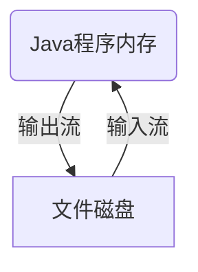

# JAVA IO

[toc]

## 文件

文件在程序中是以流的形式来操作的

```mermaid
graph TB
    A(Java程序内存)
    B[文件磁盘]
    B-->|输入流|A
    A-->|输出流|B
    
```

- 流：数据在数据源（文件）和程序（内存）之间经历的路径
- 输出流：数据从程序（内存）流向数据源（文件）的路径
- 输入流：数据从数据源（文件）流向程序（内存）的路径