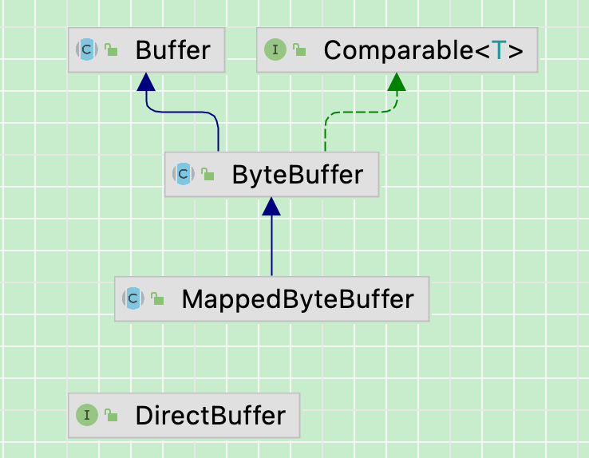
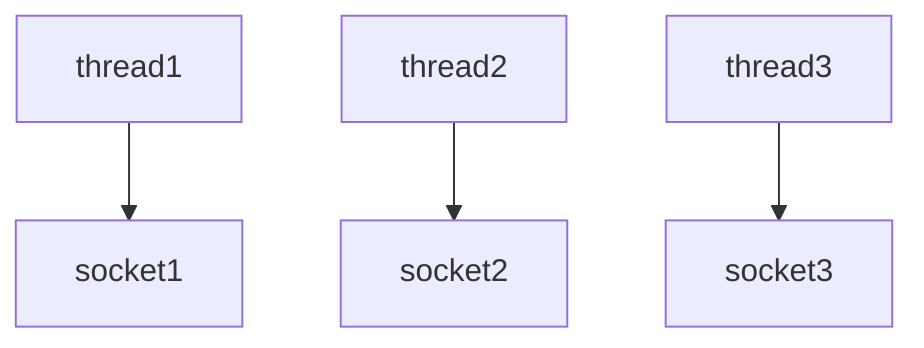
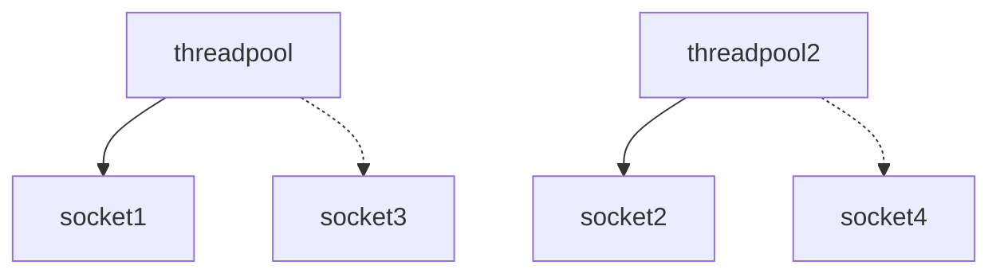
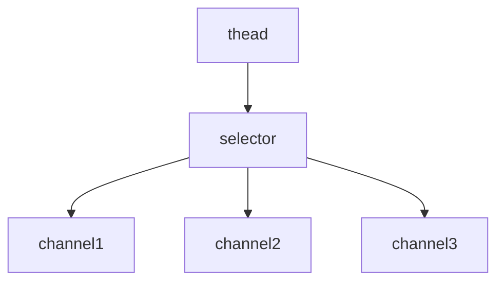

# Netty

[toc]


# 一、NIO基础之三大组件简介

## 1.Channel与Buffer

Java NIO系统的**核心**在于：**通道(Channel)和缓冲区(Buffer)**。通道表示打开到 IO 设备(例如：文件、套接字)的连接。若需要使用 NIO 系统，需要获取用于**连接 IO 设备的通道**以及用于**容纳数据的缓冲区**。然后操作缓冲区，对数据进行处理

简而言之，**通道负责传输，缓冲区负责存储**

**常见的Channel有以下四种**，其中FileChannel主要用于文件传输，其余三种用于网络通信

- FileChannel
- DatagramChannel
- SocketChannel
- ServerSocketChannel

**Buffer有以下几种**，其中使用较多的是ByteBuffer

- ByteBuffer
  - MappedByteBuffer
  - DirectByteBuffer
  - HeapByteBuffer
- ShortBuffer
- IntBuffer
- LongBuffer
- FloatBuffer
- DoubleBuffer
- CharBuffer



### Selector

在使用Selector之前，处理socket连接还有以下两种方法

#### 使用多线程技术

为每个连接分别开辟一个线程，分别去处理对应的socke连接



这种方法存在以下几个问题

- 内存占用高
  - 每个线程都需要占用一定的内存，当连接较多时，会开辟大量线程，导致占用大量内存
- 线程上下文切换成本高
- 只适合连接数少的场景
  - 连接数过多，会导致创建很多线程，从而出现问题

#### 使用线程池技术

使用线程池，让线程池中的线程去处理连接



这种方法存在以下几个问题

- 阻塞模式下，线程仅能处理一个连接

  - 线程池中的线程获取任务（task）后，**只有当其执行完任务之后（断开连接后），才会去获取并执行下一个任务**
  - 若socke连接一直未断开，则其对应的线程无法处理其他socke连接

- 仅适合

  短连接

  场景

  - 短连接即建立连接发送请求并响应后就立即断开，使得线程池中的线程可以快速处理其他连接


#### 使用选择器

**selector 的作用就是配合一个线程来管理多个 channel（fileChannel因为是阻塞式的，所以无法使用selector）**，获取这些 channel 上发生的**事件**，这些 channel 工作在**非阻塞模式**下，当一个channel中没有执行任务时，可以去执行其他channel中的任务。**适合连接数多，但流量较少的场景**



若事件未就绪，调用 selector 的 select() 方法会阻塞线程，直到 channel 发生了就绪事件。这些事件就绪后，select 方法就会返回这些事件交给 thread 来处理

## 2.ByteBuffer

### 使用案例

#### 使用方式

- 向 buffer 写入数据，例如调用 channel.read(buffer)
- 调用 flip() 切换至读模式
  - **flip会使得buffer中的limit变为position，position变为0**
- 从 buffer 读取数据，例如调用 buffer.get()
- 调用 clear() 或者compact()切换至写模式
  - 调用clear()方法时**position=0，limit变为capacity**
  - 调用compact()方法时，**会将缓冲区中的未读数据压缩到缓冲区前面**
- 重复以上步骤

**使用ByteBuffer读取文件中的内容**

```java
@Slf4j
public class TestByteBuffer {
    public static void main(String[] args) {
        //获取file channel
        try (FileChannel channel = new FileInputStream("data.txt").getChannel();){
            //划分10个字节，作为缓冲区
            ByteBuffer byteBuffer =ByteBuffer.allocate(10);
            //从channel读取数据，向buffer写入
            while (true){
                //每次只读取缓冲区大小数据，没有数据了会返回-1
                int read=channel.read(byteBuffer);
                if (read==-1){
                    break;
                }
                log.debug("读取到的字节数-{}",read);
                //打印buffer内容
                //切换buffer到读模式
                byteBuffer.flip();
                //检查剩余未读的数据
                while (byteBuffer.hasRemaining()){
                    //一次读取一个字节
                    byte b = byteBuffer.get();
                    log.debug("读取到的字节-{}",(char)b);
                }
                //读取完一次数据后，需要将channel切换成写模式
                byteBuffer.clear();
            }
        }catch (IOException e){
            log.error("e-> ",e);
        }
    }
}
```

### 核心属性

字节缓冲区的父类Buffer中有几个核心属性，如下

```java
// Invariants: mark <= position <= limit <= capacity
private int mark = -1;
private int position = 0;
private int limit;
private int capacity;
```

- **capacity**：缓冲区的容量。通过构造函数赋予，一旦设置，无法更改
- **limit**：缓冲区的界限。位于limit 后的数据不可读写。缓冲区的限制不能为负，并且**不能大于其容量**
- **position**：**下一个**读写位置的索引（类似PC）。缓冲区的位置不能为负，并且**不能大于limit**
- **mark**：记录当前position的值。**position被改变后，可以通过调用reset() 方法恢复到mark的位置。**

以上四个属性必须满足以下要求**mark <= position <= limit <= capacity**

### 核心方法

#### put()方法

- put()方法可以将一个数据放入到缓冲区中。
- 进行该操作后，postition的值会+1，指向下一个可以放入的位置。capacity = limit ，为缓冲区容量的值。


#### flip()方法

- flip()方法会**切换对缓冲区的操作模式**，由**写->读 / 读->写**
- 进行该操作后
  - 如果是写模式->读模式，position = 0 ， limit 指向最后一个元素的下一个位置，capacity不变
  - 如果是读->写，则恢复为put()方法中的值


#### get()方法

- get()方法会读取缓冲区中的一个值
- 进行该操作后，position会+1，如果超过了limit则会抛出异常
- **注意：get(i)方法不会改变position的值**


#### rewind()方法

- 该方法**只能在读模式下使用**
- rewind()方法后，会恢复position、limit和capacity的值，变为进行get()前的值


#### clean()方法

- clean()方法会将缓冲区中的各个属性恢复为最初的状态，position = 0, capacity = limit
- **此时缓冲区的数据依然存在**，处于“被遗忘”状态，下次进行写操作时会覆盖这些数据


#### mark()方法

- mark()方法会将postion的值保存到mark属性中

#### reset()方法

- reset()方法会将position的值改为mark中保存的值

#### compact()方法

**此方法为ByteBuffer的方法，而不是Buffer的方法**

- compact会把未读完的数据向前压缩，然后切换到写模式
- 数据前移后，原位置的值并未清零，写时会**覆盖**之前的值


#### clear() VS compact()

clear只是对position、limit、mark进行重置，而compact在对position进行设置，以及limit、mark进行重置的同时，还涉及到数据在内存中拷贝（会调用arraycopy）。**所以compact比clear更耗性能。**但compact能保存你未读取的数据，将新数据追加到未读取的数据之后；而clear则不行，若你调用了clear，则未读取的数据就无法再读取到了，**所以需要根据情况来判断使用哪种方法进行模式切换**

```java
@Slf4j
public class TestByteBuffer2 {
    public static void main(String[] args) {
        //新建一个buffer，接收10个数据
        ByteBuffer buffer = ByteBuffer.allocate(10);
        // 向buffer中写入1个字节的数据 查看 position/capacity/limit
        buffer.put((byte)97);
        // 使用工具类，查看buffer状态
        ByteBufferUtil.debugAll(buffer);

        // 向buffer中写入4个字节的数据
        buffer.put(new byte[]{98, 99, 100, 101});
        ByteBufferUtil.debugAll(buffer);

        // 获取数据 切换读写 position到0
        buffer.flip();
        ByteBufferUtil.debugAll(buffer);
        //获取第一个，改变position
        System.out.println(buffer.get());
        System.out.println(buffer.get());
        ByteBufferUtil.debugAll(buffer);

        // 使用compact切换模式 将未读取的数据往前移动移动到position为0的位置
        // position为未读数据数量，与clear功能相似，但保证数据不丢失
        buffer.compact();
        System.out.println("---compact----");
        ByteBufferUtil.debugAll(buffer);

        // 再次写入 从没读取的数据的长度position往后写
        buffer.put((byte)102);
        buffer.put((byte)103);
        ByteBufferUtil.debugAll(buffer);
    }
}
```

```properties
+--------+-------------------- all ------------------------+----------------+
position: [1], limit: [10]
         +-------------------------------------------------+
         |  0  1  2  3  4  5  6  7  8  9  a  b  c  d  e  f |
+--------+-------------------------------------------------+----------------+
|00000000| 61 00 00 00 00 00 00 00 00 00                   |a.........      |
+--------+-------------------------------------------------+----------------+
+--------+-------------------- all ------------------------+----------------+
position: [5], limit: [10]
         +-------------------------------------------------+
         |  0  1  2  3  4  5  6  7  8  9  a  b  c  d  e  f |
+--------+-------------------------------------------------+----------------+
|00000000| 61 62 63 64 65 00 00 00 00 00                   |abcde.....      |
+--------+-------------------------------------------------+----------------+
+--------+-------------------- all ------------------------+----------------+
position: [0], limit: [5]
         +-------------------------------------------------+
         |  0  1  2  3  4  5  6  7  8  9  a  b  c  d  e  f |
+--------+-------------------------------------------------+----------------+
|00000000| 61 62 63 64 65 00 00 00 00 00                   |abcde.....      |
+--------+-------------------------------------------------+----------------+
97
98
+--------+-------------------- all ------------------------+----------------+
position: [2], limit: [5]
         +-------------------------------------------------+
         |  0  1  2  3  4  5  6  7  8  9  a  b  c  d  e  f |
+--------+-------------------------------------------------+----------------+
|00000000| 61 62 63 64 65 00 00 00 00 00                   |abcde.....      |
+--------+-------------------------------------------------+----------------+
---compact----
+--------+-------------------- all ------------------------+----------------+
position: [3], limit: [10]
         +-------------------------------------------------+
         |  0  1  2  3  4  5  6  7  8  9  a  b  c  d  e  f |
+--------+-------------------------------------------------+----------------+
|00000000| 63 64 65 64 65 00 00 00 00 00                   |cdede.....      |
+--------+-------------------------------------------------+----------------+
+--------+-------------------- all ------------------------+----------------+
position: [5], limit: [10]
         +-------------------------------------------------+
         |  0  1  2  3  4  5  6  7  8  9  a  b  c  d  e  f |
+--------+-------------------------------------------------+----------------+
|00000000| 63 64 65 66 67 00 00 00 00 00                   |cdefg.....      |
+--------+-------------------------------------------------+----------------+
```


### **字符串与ByteBuffer的相互转换**

#### 方法一

**编码**：字符串调用getByte方法获得byte数组，将byte数组放入ByteBuffer中

**解码**：**先调用ByteBuffer的flip方法，然后通过StandardCharsets的decoder方法解码**

```java
public class Translate {
    public static void main(String[] args) {
        // 准备两个字符串
        String str1 = "hello";
        String str2 = "";
        ByteBuffer buffer1 = ByteBuffer.allocate(16);
        // 通过字符串的getByte方法获得字节数组，放入缓冲区中
        buffer1.put(str1.getBytes());
        ByteBufferUtil.debugAll(buffer1);
        // 将缓冲区中的数据转化为字符串
        // 切换模式 limit = position; position = 0; mark = -1;
        buffer1.flip();
        // 通过StandardCharsets解码，获得CharBuffer，再通过toString获得字符串
        str2 = StandardCharsets.UTF_8.decode(buffer1).toString();
        System.out.println(str2);
        ByteBufferUtil.debugAll(buffer1);
    }
}
```

```properties
+--------+-------------------- all ------------------------+----------------+
position: [5], limit: [16]
         +-------------------------------------------------+
         |  0  1  2  3  4  5  6  7  8  9  a  b  c  d  e  f |
+--------+-------------------------------------------------+----------------+
|00000000| 68 65 6c 6c 6f 00 00 00 00 00 00 00 00 00 00 00 |hello...........|
+--------+-------------------------------------------------+----------------+
hello
+--------+-------------------- all ------------------------+----------------+
position: [5], limit: [5]
         +-------------------------------------------------+
         |  0  1  2  3  4  5  6  7  8  9  a  b  c  d  e  f |
+--------+-------------------------------------------------+----------------+
|00000000| 68 65 6c 6c 6f 00 00 00 00 00 00 00 00 00 00 00 |hello...........|
+--------+-------------------------------------------------+----------------+
```


#### 方法二

**编码**：通过StandardCharsets的encode方法获得ByteBuffer，此时获得的ByteBuffer为读模式，无需通过flip切换模式

**解码**：通过StandardCharsets的decoder方法解码

```java
public class Translate2 {
    public static void main(String[] args) {
        // 准备两个字符串
        String str1 = "hello";
        String str2 = "";
        // 通过StandardCharsets的encode方法获得ByteBuffer
        // 此时获得的ByteBuffer为读模式，无需通过flip切换模式
        ByteBuffer buffer1 = StandardCharsets.UTF_8.encode(str1);
        ByteBufferUtil.debugAll(buffer1);
        // 将缓冲区中的数据转化为字符串
        // 通过StandardCharsets解码，获得CharBuffer，再通过toString获得字符串
        str2 = StandardCharsets.UTF_8.decode(buffer1).toString();
        System.out.println(str2);
        ByteBufferUtil.debugAll(buffer1);
    }
}
```

```properties
+--------+-------------------- all ------------------------+----------------+
position: [0], limit: [5]
         +-------------------------------------------------+
         |  0  1  2  3  4  5  6  7  8  9  a  b  c  d  e  f |
+--------+-------------------------------------------------+----------------+
|00000000| 68 65 6c 6c 6f                                  |hello           |
+--------+-------------------------------------------------+----------------+
hello
+--------+-------------------- all ------------------------+----------------+
position: [5], limit: [5]
         +-------------------------------------------------+
         |  0  1  2  3  4  5  6  7  8  9  a  b  c  d  e  f |
+--------+-------------------------------------------------+----------------+
|00000000| 68 65 6c 6c 6f                                  |hello           |
+--------+-------------------------------------------------+----------------+
```

#### **方法三**

**编码**：字符串调用getByte()方法获得字节数组，将字节数组传给**ByteBuffer的wrap()方法**，通过该方法获得ByteBuffer。**同样无需调用flip方法切换为读模式**

**解码**：通过StandardCharsets的decoder方法解码

```java
public class Translate3 {
    public static void main(String[] args) {
        // 准备两个字符串
        String str1 = "hello";
        String str2 = "";
        // 通过StandardCharsets的encode方法获得ByteBuffer
        // 此时获得的ByteBuffer为读模式，无需通过flip切换模式
        ByteBuffer buffer1 = ByteBuffer.wrap(str1.getBytes());
        ByteBufferUtil.debugAll(buffer1);
        // 将缓冲区中的数据转化为字符串
        // 通过StandardCharsets解码，获得CharBuffer，再通过toString获得字符串
        str2 = StandardCharsets.UTF_8.decode(buffer1).toString();
        System.out.println(str2);
        ByteBufferUtil.debugAll(buffer1);
    }
}
```

```properties
+--------+-------------------- all ------------------------+----------------+
position: [0], limit: [5]
         +-------------------------------------------------+
         |  0  1  2  3  4  5  6  7  8  9  a  b  c  d  e  f |
+--------+-------------------------------------------------+----------------+
|00000000| 68 65 6c 6c 6f                                  |hello           |
+--------+-------------------------------------------------+----------------+
hello
+--------+-------------------- all ------------------------+----------------+
position: [5], limit: [5]
         +-------------------------------------------------+
         |  0  1  2  3  4  5  6  7  8  9  a  b  c  d  e  f |
+--------+-------------------------------------------------+----------------+
|00000000| 68 65 6c 6c 6f                                  |hello           |
+--------+-------------------------------------------------+----------------+
```

### 粘包与半包

#### 现象

网络上有多条数据发送给服务端，数据之间使用 \n 进行分隔
但由于某种原因这些数据在接收时，被进行了重新组合，例如原始数据有3条为

- Hello,world\n
- I’m Nyima\n
- How are you?\n

变成了下面的两个 byteBuffer (粘包，半包)

- Hello,world\nI’m hhh\nHo
- w are you?\n

#### 出现原因

**粘包**

发送方在发送数据时，并不是一条一条地发送数据，而是**将数据整合在一起**，当数据达到一定的数量后再一起发送。这就会导致多条信息被放在一个缓冲区中被一起发送出去

**半包**

接收方的缓冲区的大小是有限的，当接收方的缓冲区满了以后，就需要**将信息截断**，等缓冲区空了以后再继续放入数据。这就会发生一段完整的数据最后被截断的现象

#### 解决办法

- 通过get(index)方法遍历ByteBuffer，遇到分隔符时进行处理。

  注意:get(index)不会改变position的值

  - 记录该段数据长度，以便于申请对应大小的缓冲区
  - 将缓冲区的数据通过get()方法写入到target中

- 调用**compact方法**切换模式，因为缓冲区中可能还有未读的数据

```java
public class ByteBufferDemo {
    public static void main(String[] args) {
        ByteBuffer buffer = ByteBuffer.allocate(32);
        // 模拟粘包+半包
        buffer.put("Hello,world\nI'm hhh\nHo".getBytes());
        // 调用split函数处理
        split(buffer);
        buffer.put("w are you?\n".getBytes());
        split(buffer);
    }
    private static void split(ByteBuffer buffer) {
        // 切换为读模式
        buffer.flip();
        ByteBufferUtil.debugAll(buffer);
        for(int i = 0; i < buffer.limit(); i++) {
            // 遍历寻找分隔符
            // get(i)不会移动position
            if (buffer.get(i) == '\n') {
                // 缓冲区长度
                int length = i+1-buffer.position();
                ByteBuffer target = ByteBuffer.allocate(length);
                // 将前面的内容写入target缓冲区
                for(int j = 0; j < length; j++) {
                    // 将buffer中的数据写入target中
                    target.put(buffer.get());
                }
                // 打印查看结果
                ByteBufferUtil.debugAll(buffer);
                // 打印查看结果
                ByteBufferUtil.debugAll(target);
            }
        }
        // 切换为写模式，但是缓冲区可能未读完，这里需要使用compact
        buffer.compact();
    }
}
```

```properties
>>>>buffer>>>>
+--------+-------------------- all ------------------------+----------------+
position: [0], limit: [22]
         +-------------------------------------------------+
         |  0  1  2  3  4  5  6  7  8  9  a  b  c  d  e  f |
+--------+-------------------------------------------------+----------------+
|00000000| 48 65 6c 6c 6f 2c 77 6f 72 6c 64 0a 49 27 6d 20 |Hello,world.I'm |
|00000010| 68 68 68 0a 48 6f 00 00 00 00 00 00 00 00 00 00 |hhh.Ho..........|
+--------+-------------------------------------------------+----------------+
>>>>buffer>>>>
+--------+-------------------- all ------------------------+----------------+
position: [12], limit: [22]
         +-------------------------------------------------+
         |  0  1  2  3  4  5  6  7  8  9  a  b  c  d  e  f |
+--------+-------------------------------------------------+----------------+
|00000000| 48 65 6c 6c 6f 2c 77 6f 72 6c 64 0a 49 27 6d 20 |Hello,world.I'm |
|00000010| 68 68 68 0a 48 6f 00 00 00 00 00 00 00 00 00 00 |hhh.Ho..........|
+--------+-------------------------------------------------+----------------+
>>>>target>>>>
+--------+-------------------- all ------------------------+----------------+
position: [12], limit: [12]
         +-------------------------------------------------+
         |  0  1  2  3  4  5  6  7  8  9  a  b  c  d  e  f |
+--------+-------------------------------------------------+----------------+
|00000000| 48 65 6c 6c 6f 2c 77 6f 72 6c 64 0a             |Hello,world.    |
+--------+-------------------------------------------------+----------------+
>>>>buffer>>>>
+--------+-------------------- all ------------------------+----------------+
position: [20], limit: [22]
         +-------------------------------------------------+
         |  0  1  2  3  4  5  6  7  8  9  a  b  c  d  e  f |
+--------+-------------------------------------------------+----------------+
|00000000| 48 65 6c 6c 6f 2c 77 6f 72 6c 64 0a 49 27 6d 20 |Hello,world.I'm |
|00000010| 68 68 68 0a 48 6f 00 00 00 00 00 00 00 00 00 00 |hhh.Ho..........|
+--------+-------------------------------------------------+----------------+
>>>>target>>>>
+--------+-------------------- all ------------------------+----------------+
position: [8], limit: [8]
         +-------------------------------------------------+
         |  0  1  2  3  4  5  6  7  8  9  a  b  c  d  e  f |
+--------+-------------------------------------------------+----------------+
|00000000| 49 27 6d 20 68 68 68 0a                         |I'm hhh.        |
+--------+-------------------------------------------------+----------------+
>>>>buffer>>>>
+--------+-------------------- all ------------------------+----------------+
position: [0], limit: [13]
         +-------------------------------------------------+
         |  0  1  2  3  4  5  6  7  8  9  a  b  c  d  e  f |
+--------+-------------------------------------------------+----------------+
|00000000| 48 6f 77 20 61 72 65 20 79 6f 75 3f 0a 27 6d 20 |How are you?.'m |
|00000010| 68 68 68 0a 48 6f 00 00 00 00 00 00 00 00 00 00 |hhh.Ho..........|
+--------+-------------------------------------------------+----------------+
>>>>buffer>>>>
+--------+-------------------- all ------------------------+----------------+
position: [13], limit: [13]
         +-------------------------------------------------+
         |  0  1  2  3  4  5  6  7  8  9  a  b  c  d  e  f |
+--------+-------------------------------------------------+----------------+
|00000000| 48 6f 77 20 61 72 65 20 79 6f 75 3f 0a 27 6d 20 |How are you?.'m |
|00000010| 68 68 68 0a 48 6f 00 00 00 00 00 00 00 00 00 00 |hhh.Ho..........|
+--------+-------------------------------------------------+----------------+
>>>>target>>>>
+--------+-------------------- all ------------------------+----------------+
position: [13], limit: [13]
         +-------------------------------------------------+
         |  0  1  2  3  4  5  6  7  8  9  a  b  c  d  e  f |
+--------+-------------------------------------------------+----------------+
|00000000| 48 6f 77 20 61 72 65 20 79 6f 75 3f 0a          |How are you?.   |
+--------+-------------------------------------------------+----------------+
```


# 二、文件编程

## 1、FileChannel

### 工作模式

FileChannel**只能在阻塞模式下工作**，所以无法搭配Selector

### 获取

不能直接打开 FileChannel，**必须**通过 FileInputStream、FileOutputStream 或者 RandomAccessFile 来获取 FileChannel，它们都有 getChannel 方法

- 通过 FileInputStream 获取的 channel **只能读**
- 通过 FileOutputStream 获取的 channel **只能写**
- 通过 RandomAccessFile 是否能读写**根据构造 RandomAccessFile 时的读写模式决定**

### 读取

通过 FileInputStream 获取channel，通过read方法将数据写入到ByteBuffer中

read方法的返回值表示读到了多少字节，若读到了文件末尾则返回-1

```java
int readBytes = channel.read(buffer);
```

**可根据返回值判断是否读取完毕**

```java
while(channel.read(buffer) > 0) {
    // 进行对应操作
    ...
}
```

### 写入

因为channel也是有大小的，所以 write 方法并不能保证一次将 buffer 中的内容全部写入 channel。必须**需要按照以下规则进行写入**

```java
// 通过hasRemaining()方法查看缓冲区中是否还有数据未写入到通道中
while(buffer.hasRemaining()) {
	channel.write(buffer);
}
```

### 关闭

通道需要close，一般情况通过try-with-resource进行关闭，**最好使用以下方法获取strea以及channel，避免某些原因使得资源未被关闭**

```java
public class TestChannel {
    public static void main(String[] args) throws IOException {
        try (FileInputStream fis = new FileInputStream("stu.txt");
             FileOutputStream fos = new FileOutputStream("student.txt");
             FileChannel inputChannel = fis.getChannel();
             FileChannel outputChannel = fos.getChannel()) {
            
            // 执行对应操作
            ...
                
        }
    }
}
```

### 位置

**position**

channel也拥有一个保存读取数据位置的属性，即position

```java
long pos = channel.position();
```

可以通过position(int pos)设置channel中position的值

```java
long newPos = ...;
channel.position(newPos);
```

设置当前位置时，如果设置为文件的末尾

- 这时读取会返回 -1
- 这时写入，会追加内容，但要注意如果 position 超过了文件末尾，再写入时在新内容和原末尾之间会有空洞（00）

### 强制写入

操作系统出于性能的考虑，会将数据缓存，不是立刻写入磁盘，而是等到缓存满了以后将所有数据一次性的写入磁盘。可以调用 **force(true)** 方法将文件内容和元数据（文件的权限等信息）立刻写入磁盘

## 2、两个Channel传输数据

### transferTo方法

使用transferTo方法可以快速、高效地将一个channel中的数据传输到另一个channel中，但**一次只能传输2G的内容**

transferTo底层使用了零拷贝技术

```java
public class TestChannel {
    public static void main(String[] args){
        try (FileInputStream fis = new FileInputStream("stu.txt");
             FileOutputStream fos = new FileOutputStream("student.txt");
             FileChannel inputChannel = fis.getChannel();
             FileChannel outputChannel = fos.getChannel()) {
            // 参数：inputChannel的起始位置，传输数据的大小，目的channel
            // 返回值为传输的数据的字节数
            // transferTo一次只能传输2G的数据
            inputChannel.transferTo(0, inputChannel.size(), outputChannel);
        } catch (IOException e) {
            e.printStackTrace();
        }
    }
}
```

当传输的文件**大于2G**时，需要使用以下方法进行多次传输

```java
public class TestChannel {
    public static void main(String[] args){
        try (FileInputStream fis = new FileInputStream("stu.txt");
             FileOutputStream fos = new FileOutputStream("student.txt");
             FileChannel inputChannel = fis.getChannel();
             FileChannel outputChannel = fos.getChannel()) {
            long size = inputChannel.size();
            long capacity = inputChannel.size();
            // 分多次传输
            while (capacity > 0) {
                // transferTo返回值为传输了的字节数
                capacity -= inputChannel.transferTo(size-capacity, capacity, outputChannel);
            }
        } catch (IOException e) {
            e.printStackTrace();
        }
    }
}
```

## 3、Path与Paths

- Path 用来表示文件路径
- Paths 是工具类，用来获取 Path 实例

```java
// 相对路径 不带盘符 使用 user.dir 环境变量来定位 1.txt
Path source = Paths.get("1.txt"); 
// 绝对路径 代表了  d:\1.txt 反斜杠需要转义
Path source = Paths.get("d:\\1.txt"); 
// 绝对路径 同样代表了  d:\1.txt
Path source = Paths.get("d:/1.txt"); 
// 代表了  d:\data\projectsCopy
Path projects = Paths.get("d:\\data", "projects"); 
```

- `.` 代表了当前路径
- `..` 代表了上一级路径

例如目录结构如下

```
d:
	|- data
		|- projects
			|- a
			|- bCopy
```

代码

```
Path path = Paths.get("d:\\data\\projects\\a\\..\\b");
System.out.println(path);
System.out.println(path.normalize()); // 正常化路径 会去除 . 以及 ..Copy
```

输出结果为

```
d:\data\projects\a\..\b
d:\data\projects\bCopy
```

## 4、Files

### 查找

检查文件是否存在

```java
Path path = Paths.get("helloword/data.txt");
System.out.println(Files.exists(path));
```

### 创建

创建**一级目录**

```java
Path path = Paths.get("helloword/d1");
Files.createDirectory(path);
```

- 如果目录已存在，会抛异常 FileAlreadyExistsException
- 不能一次创建多级目录，否则会抛异常 NoSuchFileException

创建**多级目录用**

```java
Path path = Paths.get("helloword/d1/d2");
Files.createDirectories(path);
```

### 拷贝及移动

**拷贝文件**

```java
Path source = Paths.get("helloword/data.txt");
Path target = Paths.get("helloword/target.txt");

Files.copy(source, target);
```

- 如果文件已存在，会抛异常 FileAlreadyExistsException

如果希望用 source **覆盖**掉 target，需要用 StandardCopyOption 来控制

```java
Files.copy(source, target, StandardCopyOption.REPLACE_EXISTING);
```

移动文件

```java
Path source = Paths.get("helloword/data.txt");
Path target = Paths.get("helloword/data.txt");

Files.move(source, target, StandardCopyOption.ATOMIC_MOVE);
```

- **StandardCopyOption.ATOMIC_MOVE 保证文件移动的原子性**

### 删除

删除文件

```java
Path target = Paths.get("helloword/target.txt");

Files.delete(target);
```

- 如果文件不存在，会抛异常 NoSuchFileException

删除目录

```java
Path target = Paths.get("helloword/d1");

Files.delete(target);
```

- 如果**目录还有内容**，会抛异常 DirectoryNotEmptyException

### 遍历文件夹

可以**使用Files工具类中的walkFileTree(Path, FileVisitor)方法**，其中需要传入两个参数

- Path：文件起始路径

- FileVisitor：文件访问器，

  使用访问者模式

  - 接口的实现类

    SimpleFileVisitor

    有四个方法

    - preVisitDirectory：访问目录前的操作
    - visitFile：访问文件的操作
    - visitFileFailed：访问文件失败时的操作
    - postVisitDirectory：访问目录后的操作

```java
public class TestWalkFileTree {
    public static void main(String[] args) throws IOException {
        Path path = Paths.get("/Users/hhh/workspace/code/study/my-netty");
        // 文件目录数目
        AtomicInteger dirCount = new AtomicInteger();
        // 文件数目
        AtomicInteger fileCount = new AtomicInteger();
        Files.walkFileTree(path, new SimpleFileVisitor<Path>(){
            @Override
            public FileVisitResult preVisitDirectory(Path dir, BasicFileAttributes attrs) throws IOException {
                System.out.println("===>"+dir);
                // 增加文件目录数
                dirCount.incrementAndGet();
                return super.preVisitDirectory(dir, attrs);
            }

            @Override
            public FileVisitResult visitFile(Path file, BasicFileAttributes attrs) throws IOException {
                System.out.println(file);
                // 增加文件数
                fileCount.incrementAndGet();
                return super.visitFile(file, attrs);
            }
        });
        // 打印数目
        System.out.println("文件目录数:"+dirCount.get());
        System.out.println("文件数:"+fileCount.get());
    }
}
```

# 三、网络编程

## 阻塞VS非阻塞

### 阻塞

#### 思考

- 阻塞模式是怎么回事？
  - 一个方法的执行会影响另外的方法执行，例如如下案例中，accept与read会互相阻塞
- 单线程能不能处理多个客户端？
  - 可以同时处理多个客户端

#### 阻塞模式下服务器端接收数据

- 启动服务端后，线程会在`serverSocketChannel.accept();`方法阻塞，等待客户端链接
- 客户端链接后，服务器端取消阻塞，线程继续运行，会在方法`channel.read(BYTE_BUFFER);`中继续阻塞，等待客户端发送数据
- 接收完数据，代码继续运行，又在`serverSocketChannel.accept();`中继续阻塞，会导致当前客户端没有重新建立链接的情况下，会在accept方法一直阻塞，无法获取旧客户端重新发送的数据，必须要有新的客户端链接，才会继续执行，导致一个客户端只能发送一条数据到服务端，服务端要想消费客户端数据，必须重新链接

服务器端：

```java
/**
 * <p>
 * 描述: 服务器 通道负责传输，缓冲区负责存储
 * 使用单线程来理解阻塞模式
 * </p>
 *
 * @author hhh
 * @since 2022/6/26
 */
@Slf4j
public class Server {

    /**
     * 创建一个ByteBuffer用来缓冲数据
     */
    private static final ByteBuffer BYTE_BUFFER = ByteBuffer.allocate(16);

    public static void main(String[] args) throws Exception{
        //开启服务器
        ServerSocketChannel serverSocketChannel = ServerSocketChannel.open();
        //绑定监听端口
        serverSocketChannel.bind(new InetSocketAddress(8080));
        //建立链接集合
        List<SocketChannel> channels = new ArrayList<>();
        while (true){
            log.info("connecting...");
            //建立链接 accept accept为一个阻塞方法，会使线程暂停，等待客户端链接
            SocketChannel socketChannel = serverSocketChannel.accept();
            //与客户端进行数据读写，通过SocketChannel与客户端进行通信读写操作
            channels.add(socketChannel);
            log.info("connected...{}",socketChannel);
            //接收客户端发送的数据，遍历channels集合，拿到channel，接收数据
            for (SocketChannel channel : channels) {
                log.info("before read...{}",channel);
                //将SocketChannel中读取的数据，存储到BYTE_BUFFER中，read也是一个阻塞方法，会使线程暂停，等待客户端发送数据
                channel.read(BYTE_BUFFER);
                //切换BYTE_BUFFER到读模式
                BYTE_BUFFER.flip();
                //打印BYTE_BUFFER中的数据
                debugRead(BYTE_BUFFER);
                log.info("after read...{}",channel);
                //清空数据，切换回写模式
                BYTE_BUFFER.clear();
            }
        }
    }
}
```

客户端：

```java

/**
 * <p>
 * 描述:客户端
 * </p>
 *
 * @author hhh
 * @since 2022/6/26
 */
public class Client {

    public static void main(String[] args) throws IOException {
        //建立一个SocketChannel
        SocketChannel socketChannel = SocketChannel.open();
        socketChannel.connect(new InetSocketAddress("localhost", 8080));
        socketChannel.write(Charset.defaultCharset().encode("hello1"));
        //无法重复发送数据，客户端被accept 方法阻塞住了 hello2 数据无法被接收
        socketChannel.write(Charset.defaultCharset().encode("hello2"));
        System.out.println("waiting");
    }
}
```

### 非阻塞模式

#### 思考

- 非阻塞模式是怎么回事？
  - accept与read不会互相阻塞，代码会一直运行，需要手动判断是否有链接或客户端是否发送数据
- 单线程能不能处理多个客户端？
  - 可以同时处理多个客户端

#### 非阻塞模式下服务器端接收数据

- 非阻塞模式下，虽然解决了阻塞模式下，ServerSocketChannel.accept与SocketChannel.read阻塞的问题，但是会导致该线程一直空转，channel中无数据，也会一直循环读取，造成CPU资源的浪费，如果是单核CPU，会导致CPU占用100%但又不处理具体事务

```java
/**
 * <p>
 * 描述: 服务器 通道负责传输，缓冲区负责存储
 * 使用单线程来理解阻塞模式
 * </p>
 *
 * @author hhh
 * @since 2022/6/26
 */
@Slf4j
public class ServerUnBlock {

    /**
     * 创建一个ByteBuffer用来缓冲数据
     */
    private static final ByteBuffer BYTE_BUFFER = ByteBuffer.allocate(16);

    public static void main(String[] args) throws Exception{
        //开启服务器
        ServerSocketChannel serverSocketChannel = ServerSocketChannel.open();
        //设置ServerSocketChannel 为非阻塞，serverSocketChannel.accept()无链接时不会阻塞，会返回一个null
        serverSocketChannel.configureBlocking(Boolean.FALSE);
        //绑定监听端口
        serverSocketChannel.bind(new InetSocketAddress(8080));
        //建立链接集合
        List<SocketChannel> channels = new ArrayList<>();
        while (true){
            //建立链接 accept accept为一个阻塞方法，阻塞模式下，会使线程暂停，等待客户端链接
            SocketChannel socketChannel = serverSocketChannel.accept();
            if (socketChannel!=null){
                log.info("connecting...");
                //与客户端进行数据读写，通过SocketChannel与客户端进行通信读写操作
                channels.add(socketChannel);
                log.info("connected...{}",socketChannel);
            }
            //接收客户端发送的数据，遍历channels集合，拿到channel，接收数据
            for (SocketChannel channel : channels) {
                log.info("before read...{}",channel);
                //设置SocketChannel为非阻塞，channel.read(BYTE_BUFFER);无数据时，size为0
                channel.configureBlocking(Boolean.FALSE);
                //将SocketChannel中读取的数据，存储到BYTE_BUFFER中，阻塞模式下，read也是一个阻塞方法，会使线程暂停，等待客户端发送数据
                int read = channel.read(BYTE_BUFFER);
                if (read <= 0){
                    continue;
                }
                //切换BYTE_BUFFER到读模式
                BYTE_BUFFER.flip();
                //打印BYTE_BUFFER中的数据
                debugRead(BYTE_BUFFER);
                log.info("after read...{}",channel);
                //清空数据，切换回写模式
                BYTE_BUFFER.clear();
            }
        }
    }
}

```


