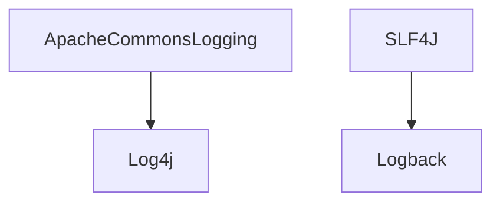
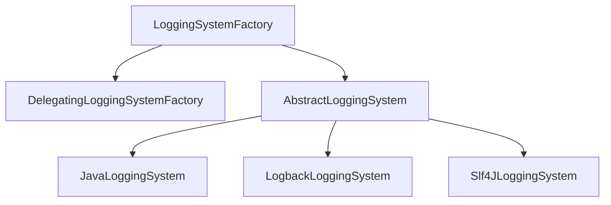

# Spring-Log梳理

[toc]

## 各个日志组件之间的关系

- Apache Commons Logging：是一个日志标准（打日志不方便，不支持占位符）
  - Log4J基于Apache Commons Logging实现了一套日志框架（性能不高）
- SLF4J：也是一个日志标准
  - Logback：基于SLF4J实现了一套日志框架




## Spring jcl日志源码解析

在Spring中，我们输出日志的代码如下：

```java
    @GetMapping("/test")
    public String test() {
        Log log = LogFactory.getLog(TestController.class.getName());
        Logger logger = LoggerFactory.getLogger(TestController.class.getName());
        log.info("LogFactory xxxx");
        logger.info("LoggerFactory xxxxx");
        return "SUCCESS";
    }
```

我们可以看下LogFactory与LoggerFactory相应的源码

### LogFactory

#### jcl

对于LogFactory，Spring对于Apache common Log日志规范，做了一层抽象，jcl，用了一个适配器，去整合现在市面上的主流日志框架，其代码结构如下：


#### Log

在本包中，有一个顶层抽象接口log，拷贝了org.apache.commons.logging的log规范，规定了一个log组件需要的方法


#### LogAdapter

日志适配器，用来适配各个厂商的日志，在其中有一段static代码块，使用SPI去获取当前项目使用的日志组件

- log4j-to-slf4j-> 我们宁愿使用 SLF4J SPI；然而，我们仍然更喜欢 Log4j 而不是普通的 SLF4J API，因为后者不支持位置感知,Spring默认使用SLF4J_LAL
- 直接使用 Log4j 2.x，包括位置感知支持


#### 获取具体日志


如果是SLF4J


#### 输出日志


使用通过SP实例化出的日志组件，输出具体日志信息：


## Spring Boot初始化日志框架

摁住control找到使用这些配置的位置，找到`LoggingApplicationListener`，这个类就是Spring Boot初始化日志的类


### LoggingApplicationListener

该类实现了GenericApplicationListener，查看其onApplicationEvent方法


Spring Boot在这代码类中，对日志进行了初始化


### 解压jar包

在Spring boot2.7.1版本中，Spring boot jar默认不会解压，需要使用jar包，将源码进行解压Java -jar

```xml
        <dependency>
            <groupId>org.springframework.boot</groupId>
            <artifactId>spring-boot-loader</artifactId>
        </dependency>
```

### LoggingSystem与LoggingSystemFactory

#### LoggingSystemFactory

LoggingSystem由LoggingSystemFactory确认并取出，会加载如下三个类，然后根据SPI判断加载哪个日志框架


默认加载LogbackLoggingSystem


#### LoggingSystem

在Springboot中，有一套与Spring jcl相同性质的日志适配器，为loggingSystem，用于加载/配置各个日志组件


#### LoggingSystem的代码设计

驱动执行代码

```java
	// LoggingSystemFactory提供
	private static final LoggingSystemFactory SYSTEM_FACTORY = LoggingSystemFactory.fromSpringFactories();

	LoggingSystem loggingSystem = SYSTEM_FACTORY.getLoggingSystem(classLoader);
```




- LoggingSystemFactory，提供一个接口，getLoggingSystem，子类所有的方法去实现

  

- DelegatingLoggingSystemFactory实现getLoggingSystem，获取所有的SpringFactoriesLoader.loadFactories的日志框架


- 取出AbstractLoggingSystem的子类，确定使用哪个日志组件，例如LogbackLoggingSystem


### 实例化类loggingSystem

监听到Spring发布的启动事件后，出触发启动事件Event，加载loggingSystem。


解压出spring-boot-2.7.1.jar后，发现Springboot默认配置了如下三个日志类


会加载如下三个类，然后根据SPI判断加载哪个日志框架


默认加载LogbackLoggingSystem


通过不同的LogSystem去设置日志属性

### 设置日志级别

如下为Spring Boot设置日志级别的代码，如果我们有需求，比如生产出bug了，需要动态刷新Spring Boot的日志级别，那么就可以使用如下代码去刷新，可以监听Nacos的刷新事件，也可以直接写个Controller去刷新

```java
	protected void setLogLevels(LoggingSystem system, ConfigurableEnvironment environment) {
		BiConsumer<String, LogLevel> customizer = getLogLevelConfigurer(system);
		Binder binder = Binder.get(environment);
		Map<String, LogLevel> levels = binder.bind(LOGGING_LEVEL, STRING_LOGLEVEL_MAP).orElseGet(Collections::emptyMap);
		levels.forEach((name, level) -> configureLogLevel(name, level, customizer));
	}

	private BiConsumer<String, LogLevel> getLogLevelConfigurer(LoggingSystem system) {
		return (name, level) -> {
			try {
				name = name.equalsIgnoreCase(LoggingSystem.ROOT_LOGGER_NAME) ? null : name;
        //通过logging system 设置日志级别
				system.setLogLevel(name, level);
			}
			catch (RuntimeException ex) {
				this.logger.error(LogMessage.format("Cannot set level '%s' for '%s'", level, name));
			}
		};
	}

	private void configureLogLevel(String name, LogLevel level, BiConsumer<String, LogLevel> configurer) {
		if (this.loggerGroups != null) {
			LoggerGroup group = this.loggerGroups.get(name);
			if (group != null && group.hasMembers()) {
				group.configureLogLevel(level, configurer);
				return;
			}
		}
		configurer.accept(name, level);
	}
```

通过configureLogLevel#configurer.accept(name, level)去设置日志级别，

## 总结

对于日志系统，Spring Boot内部只会维护一套，我们拿spring boot默认使用logback的举例子，记得前文说的，日志的继承关系


SLF4J，会有一个实现框架，为Springboot默认使用的Logback

### Apache common logging

例如我们使用的是Apache common logging

```java
Log log = LogFactory.getLog(TestController.class.getName());
```

那么会通过其内部LogAdapter，转成SLF4J


### Slf4J

```java
@Slf4j //lombok注解也被编译成如下代码
或者
private static final Logger log = LoggerFactory.getLogger(TestController.class);
```

通过静态方法，内部维护一个全局的Logger单例对象，使用上述代码取出的都是一个Logger对象，保证获取到的是配置过的Logger


### Log4j2

```java
@Log4j2 //lombok注解会被编译成如下代码
或者
private static final Logger log = LogManager.getLogger(TestController.class);
```

对于Log4J2，Log4J2会在项目启动的时候，将其使用Log4j to SLF4J，转成SLF4J的实现，factory=SLF4JLoggerContextFactory


通过LogManager获取Log


获取上文放入的JLoggerContextFactory为SLF4JLoggerContextFactory


通过log4j-to-slf4j，将Log4J成slf4j实现，就是logback


