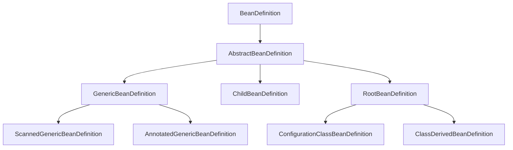

# Spring源码的CRUD

[toc]

## 准备工作

在开始阅读Spring项目之前，可以选择将[spring-framework](https://github.com/spring-projects/spring-framework) fork到自己的仓库


Fork完成后，Spring 的项目就被创建到了我们的仓库下


### 拉取/编译项目

#### 拉取

项目Fork到我们的仓库后，我们clone项目代码，可以`git checkout main`然后`git checkout -b you-branch`切出个自己的分支，在自己的分支上进行源码阅读，与源码注释标记。

#### 编译

Spring项目是基于Gradle编译，我们拉取Spring项目后，IDEA会自动进行编译，因为墙的原因，会导致编译下载速度非常慢，如有翻墙的同学，可以在IDEA中配置下代理，没有代理的同学可以慢慢等IDEA下载完Gradle依赖，差不多一天可以处理完


#### 进阶

Fork到我们自己的仓库后，我们项目的Spring 代码就不会在进行更新了，比如过了一段时间，Spring发布了一个大的Releases版本，是我们比较感兴趣的，想再我们自己的branch将Spring- project中的代码更新到我们的仓库，可以进行如下操作

- 添加upstream 为Spring project地址：`git remote add upstream https://github.com/spring-projects/spring-framework `
- 查看所有远程地址：`git remote -v `


- 将远程的更新同步到本地：`git fetch upstream`

- 查看本地版本更新，确认已经拉到了最新数据：`git branch -a`
- 切换到我们自己的分支:`git checkout you-branch`
- 将远程的代码更新到我们自己的分支：`git merge upstream/main`
- 如果有冲突，选择accept their ，同意Spring的代码，将Spring的修改，同步到我们的分支
- 将我们的分支强制推送到远程：`git push -f`

## 概念

阅读Spring源码的过程中，理解如下概念是很重要的

### Spring 顶层接口体系结构

对于Spring框架，它的继承结构是非常庞大的，我们可以从Alias Registry切入，用这个线头，先看下我们平常使用的BeanFactory的继承结构，接口的意思是提供某种能力，我们知道了其继承体系，就知道了，这个功能将会拥有什么功能。对于Spring源码，我们理解其大框架是非常有意义的，对于下图的类，最好做到见名知其功能，因为它们会在Spring代码中反复出现


### AliasRegistry

本次的分享的主题是，从CRUD的视角看Spring，那么我们就需要找出对应我们开发过程中的`数据库`。在Spring中，个人认为其最顶类为AliasRegistry，如下2个类，从其继承而来，所有的Spring 工厂的启动/操作，其实都是对这2个存储容器的CRUD

- Spring的BeanDefinition注册地`SimpleBeanDefinitionRegistry`，beanDefinitionMap用来存储所有的bean definition


- Bean注册地`DefaultSingletonBeanRegistry`。在Spring中，对于一级/二级/三级缓存的操作，其实就跟我们平常操作数据库中的数据过程是一样的，Spring在启动过程中，查找出所有的Bean，生成Bean Definition，存入一级缓存，然后将值取出，反射放入我们需要注入的属性中，Spring提供的扩展，就是提供了让我们修改Spring中Bean数据功能。


### BeanDefinition

我们常说，Spring 是bean工厂，那么对于工厂，生产产品，必定需要一个生产图纸，Spring可以按照我们给出的图纸，去生产bean，后将生产出的Bean Definition存入到beanDefinitionMap，BeanDefinition就是生产图纸，我们查看其直接子类，Abstract Bean Definition的属性，打红框的，都是我们比较熟悉的，可以通过一些注解/扩展接口，去设置这些属性，达到修改Spring Bean 生产图纸的目的：


#### Bean Definition的子类实现

在阅读源码的过程中，大家会发现，Spring一直在对Bean Definition进行类型转换，在其各个子类中转来转去，用来适配其不同的功能，达到控制变量，比如RootBean Definition中只有大家都通用的功能，如果你有特殊扩展，那么就继承基类，后使用多态根据不同的使用场景，做类型判断后，进行类型转换，取出自己类特殊含有的数据。



#### AbstractBeanDefinition

AbstractBeanDefinition作为抽象类，简单实现所有的方法，spring中，类开头带Abstract的代表类为一个模板类，会在该类中，对所有所继承的接口，进行实现，然后提供需要子类实现的方法，**AbstractBeanDefinition只负责规定方法的执行模板，子类按照模板中提供的abstract方法进行相应实现**，如下5个子类，都实现了AbstractBeanDefinition，并对其的 cloneBeanDefinition()方法进行实现，提供不同的 cloneBeanDefinition()，就可以使多个同级的BeanDefinition相互之间进行拷贝/clone


#### GenericBeanDefinition

GenericBeanDefinition提供了通用的BeanDefinition，代表其是最简单且可直接使用的BeanDefinition，其实现 cloneBeanDefinition()方法如下：


只有一个super()方法，相当于new了一个AbstractBeanDefinition，拥有其所有的能力的GenericBeanDefinition


#### ConfigurationClassBeanDefinition

ConfigurationClassBeanDefinition比GenericBeanDefinition，多了一些属性，代表其不仅仅拥有AbstractBeanDefinition最基础的能力与属性，还拥有它自己的一些属性，例如annotationMetadata/factoryMethodMetadata，我们使用注解生成的BeanDefinition默认就是使用这个


#### 不同的BeanDefinition

分清楚不同的Bean Definition的作用，是非常有用的，例如如下代码，就会针对扫描出的不同的Bean Definition做不同的处理


### BeanFactory


BeanFactory提供顶层接口规范，就是一堆的get方法


#### ConfigurableBeanFactory

ConfigurableBeanFactory提供set方法，使Bean factory接口中的方法可配置，get与set分离的好处，个人理解还有一点是：get方法，是给开发人员使用的，而set方法，是给框架设置使用的，将get与set分离，例如我注入Bean Factory，那么开发人员就只能用其中的get方法，不会因为误使用了set方法，导致框架出现异常


#### AbstractBeanFactory

AbstractBeanFactory作为抽象类，简单实现所有的方法，spring中，类开头带Abstract的代表类为一个模板类，会在该类中，对所有所继承的接口，进行实现，然后提供需要子类实现的方法，**AbstractBeanFactory只负责规定方法的执行模板，子类按照模板中提供的abstract方法进行相应实现**


例如spring中，可以使用xml的方式定义bean，使用注解的方式定义bean等方式，那个在AbstractBeanFactory类中的get bean方法，ta

它提供了一个createBean的抽象方法，让不同的子类，按照不同的规则去生成bean，然后由AbstractBeanFactory提供的模板方法调用，走相同的流程


#### AbstractBeanFactory模板方法

模板方法getBean，调用本类的方法，本类只提供空实现，具体由子类实现，可以进行debug看代码的流程


#### DefaultListableBeanFactory

spring doc中对其的描述

- 是一个成熟的 Bean factory，代表可以直接使用，集成了所有的接口功能
- 先注册bean definition，缓存bean，使得获取bean变为一项廉价的功能

```java
Spring's default implementation of the {@link ConfigurableListableBeanFactory}
and {@link BeanDefinitionRegistry} interfaces: a full-fledged bean factory
 based on bean definition metadata, extensible through post-processors.
 
  <p>Typical usage is registering all bean definitions first (possibly read
  from a bean definition file), before accessing beans. Bean lookup by name
  is therefore an inexpensive operation in a local bean definition table,
  operating on pre-resolved bean definition metadata objects.
```

查看其类的继承关系，可以发现，在bean factory中，只封装了规范，就是只封装了get方法，至于怎么去获取，数据存在哪里，就由子类自己去定义，这就是接口的功能，制定规范，描述功能。在Spring中，会将get与set方法分开，get方法会作为最顶层抽象，然后都会有一个Configuration类，提供set方法，这样的好处还是为了好扩展，要是我们想我们可以只依赖Spring的接口，根据他们的规范，写一个自己的Spring框架


## AnnotationConfigApplicationContext

与BeanFactory，套路一致，ApplicationContext为最顶层接口，由其提供规范


#### ConfigurableApplicationContext

由ConfigurableApplicationContext去提供可设置方法，将set/get分离，get与set分离的好处，个人理解还有一点是：get方法，是给开发人员使用的，而set方法，是给框架设置使用的，将get与set分离，例如我注入Bean Factory，那么开发人员就只能用其中的get方法，不会因为误使用了set方法，导致框架出现异常


#### AbstractApplicationContext

AbstractApplicationContext提供模板抽象能力，让子类去实现，与AbstractBeanFactory不同的是，AbstractBeanFactory提供的是生成单个bean的模板抽象，而AbstractApplicationContext提供的是，Spring容器级别的抽象，我们扩展如下三个方法，就可以指定我们所需要使用的BeanFactory，也就是我们常说的Spring 容器


#### GenericApplicationContext

GenericApplicationContext提供简单实现，Generic翻译过来为通用的，代表它是一个通用的，可以直接用来继承/扩展的类，它继承了AbstractApplicationContext，提供私有属性beanFactory，用来保存bean Factory


## 对于Spring设计思想的总结

对于上文所述的从接口，到Abstract到Configuration到Generic，在Spring源码中到处可见，例如

- EventListener下的ApplicationListener
- Environment下的StandardServletEnvironment

个人总结，Spring这么设计的目的是

- 提供模板，提供标准实现，增强代码扩展能力
- 通过接口分层，针对接口的权限进行划分，例如顶层接口只提供get方法，不会提供权限较大的set方法
- 统一规范，Spring较为重要的类，都遵从统一设计规范

## BeanFactory与FactoryBean

- Bean Factory：指的是，Spring创建@Component的bean的工厂
- FactoryBean：个人理解的是，如果将Spring 比作一个工厂，BeanFactory的产品，是Spring自己生产的，比如我们打了一个@Component注解，Spring就去寻找我们的构造方法，将实例创建出来，而FactoryBean是别的代工厂生产的产品，在我Spring容器中存放，有使用的是，spring在将其统一提供给用户。
  - 例如@Bean，生成的Bean是我们自己定义的
  - 例如Mybatis的Mapper对象，是DefaultSqlSession Factory工厂生产的，将mapper代理对象给spring容器托管，借用Spring的功能，将Mybatis的代理对象inject给属性
  - 简单的说，就是我的bean对象自己产生，不要用Spring生成的，我的bean是有特殊功能的

## BeanFactoryPostProcessor


Bean 工厂级别的后置处理器。例如ConfigurationClassPostProcessor，在Spring容器启动阶段，按照Spring的规则扫描出BeanDefinition，自带的ConfigurationClassPostProcessor是扫描优先级最高的，我们也可以注册我们自己的BeanFactoryPostProcessor 的Bean Definition给Spring，对其进行扩展


## BeanPostProcessor


Bean的后置处理器，

### Spring注解

注解的意思为一种语法糖，每个糖都会有其糖衣，在注解中，都会有其针对注解逻辑处理的代码

个人理解，Spring的注解主要分为如下三个等级

- @ComponentScan：用来加载下一层注解数据，（正常开发场景，一定要配置）
- 加载出@Component/@Bean/@Import，注册为BeanDefinition（正常开发场景，一定要配置）
- 扫描第三层注解，加入BeanDefinition属性


### 容器启动

通过reader去加载BeanFactoryPostProcessor，加载系统基础设施级别的BeanFactory后置处理器，用来使Spring容器正常运行


## AOP

Spring的AOP其实是比较简单的，我们只需要知道，Spring到底用的是JDK动态代理还是CGLIB的动态代理，去查看对于的invoke代码的执行就行了，主要调试下代码织入的流程，理解了下图，就对Spring的AOP有了一个概念性的认知


### ProxyCreatorSupport

获取指定的代理工厂AopProxyFactory，生成AopProxy对象

- JdkDynamicAopProxy：invoke，执行被代理对象逻辑
- ObjenesisCglibAopProxy：CglibAopProxy#DynamicAdvisedInterceptor#intercept，根据解析的CglibMethodInvocation，执行动态代理

### ProxyFactory

由proxy factory确定代理工厂


### JdkDynamicAopProxy

- 实现AopProxy提供的getProxy方法
- 实现InvocationHandler提供的invoke方法，用于代理回调，核心方法
- 通过反射，调用真实方法


```java
@Nullable
public static Object invokeJoinpointUsingReflection(@Nullable Object target, Method method, Object[] args)
      throws Throwable {

   // Use reflection to invoke the method.
   try {
      ReflectionUtils.makeAccessible(method);
      //使用反射，method.invoke执行被调用代码
      return method.invoke(target, args);
   }
   catch (InvocationTargetException ex) {
      // Invoked method threw a checked exception.
      // We must rethrow it. The client won't see the interceptor.
      throw ex.getTargetException();
   }
   catch (IllegalArgumentException ex) {
      throw new AopInvocationException("AOP configuration seems to be invalid: tried calling method [" +
            method + "] on target [" + target + "]", ex);
   }
   catch (IllegalAccessException ex) {
      throw new AopInvocationException("Could not access method [" + method + "]", ex);
   }
}
```

### ObjenesisCglibAopProxy

- 实现AopProxy提供的getProxy方法
- 实现invokeMethod方法，用于代理回调，核心方法
- 是一个责任链织入的过程


#### DynamicAdvisedInterceptor

- DynamicAdvisedInterceptor：为默认的动态代理的实现类，生成的cglib责任链如下
- CGLIB的执行核心逻辑都在这个类中的intercept方法

```java
		//核心逻辑：默认加了7条过滤器链条
		Callback[] mainCallbacks = new Callback[] {
				aopInterceptor,  // 一般的织入
				targetInterceptor,  // 如果优化，则在不考虑建议的情况下调用目标
				new SerializableNoOp(),  // no override for methods mapped to this
				targetDispatcher, this.advisedDispatcher,
				new EqualsInterceptor(this.advised),
				new HashCodeInterceptor(this.advised)
		};
```


织入完成后，代码会按照我们织入的责任链的执行顺序执行代码，除了第一个其他都没啥用

### Spring 帮我们做的代理

- @Lazy :ContextAnnotationAutowireCandidateResolver#getLazyResolutionProxyIfNecessary
- @Lookup:CglibSubclassingInstantiationStrategy#instantiate

DefaultAopProxyFactory判断使用jdk还是cglib动态代理

调试如下代码：

```java
   public static void main(String[] args){
   AnnotationConfigApplicationContext annotationConfigApplicationContext = new AnnotationConfigApplicationContext(AppConfig.class);
   UseMyLazyBean bean = annotationConfigApplicationContext.getBean(UseMyLazyBean.class);
   bean.test0();
   bean.test1();
   bean.test2();
}
```

会使用ContextAnnotationAutowireCandidateResolver，判断是否lazy，lazy会进代理代码。

### 我们自己创建的代理

```java
@Component
@Aspect
public class HandleAspect {

	@Pointcut("execution(* org.hhh.lazy..*.*(..))")
	public void cutPoint() {
		//@Pointcut 定义切入点
	}


	@Before("cutPoint()")
	public void aopBefore() {
		//@Before 前置通知：目标方法之前执行
		System.out.println("Before");
	}
}
```

#### AbstractAutoProxyCreator

- 调用AbstractAutoProxyCreator.wrapIfNecessary.createProxy，进行类代理包装，Spring项目启动，什么都没做，织入的逻辑都是通过执行的时候，解析的


真正的执行逻辑在CglibAopProxy.DynamicAdvisedInterceptor#intercept

### Spring会自动切换代理的案例


### CGLIB vs JDK

由上我们可知，在我们的代码中，有接口与无接口，Spring生成的代理是不同的，JDK的优势如下

- JDK快于CGLIB(http://docs.spring.io/spring/docs/2.5.x/reference/aop.html#aop-proxying)
- CGLIB已经很久没有迭代更新了
- CGLIB毕竟属于第三方库，尽量减少第三方库的依赖总是对的

