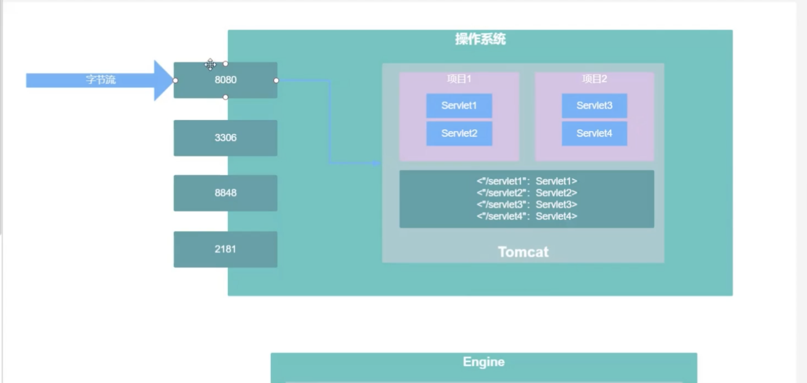
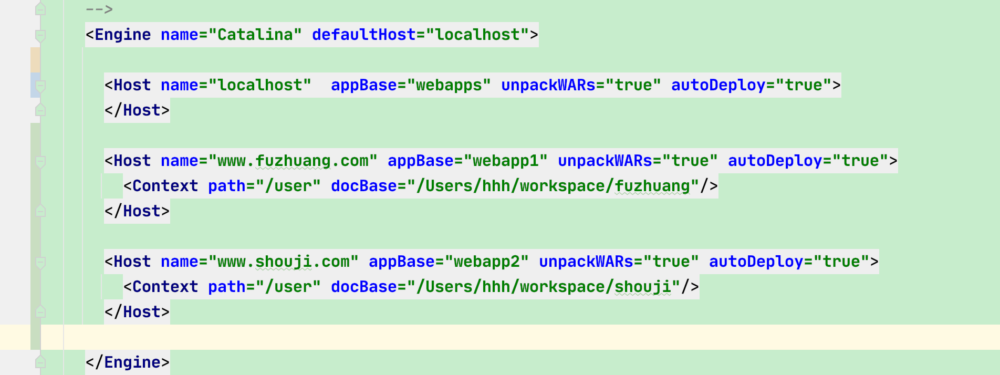
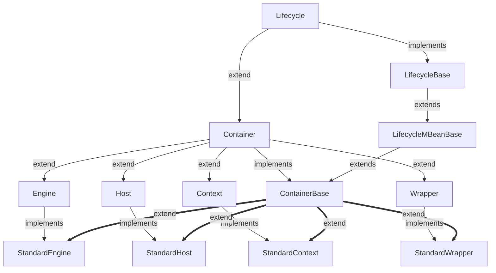
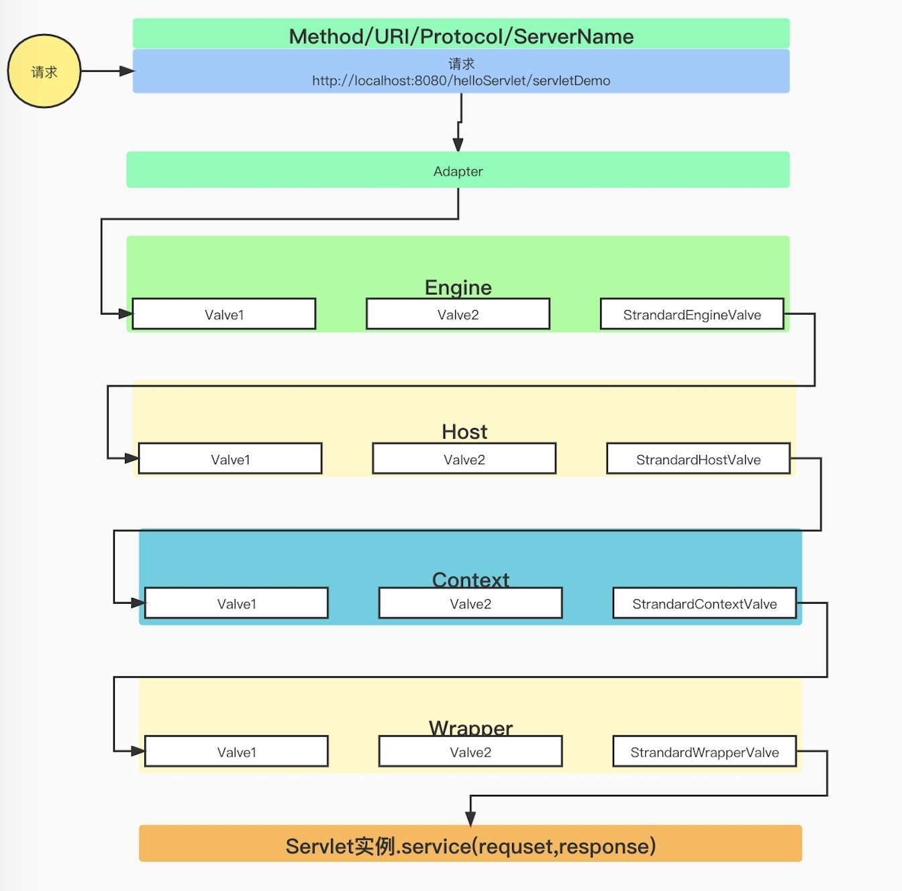
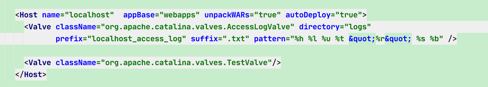
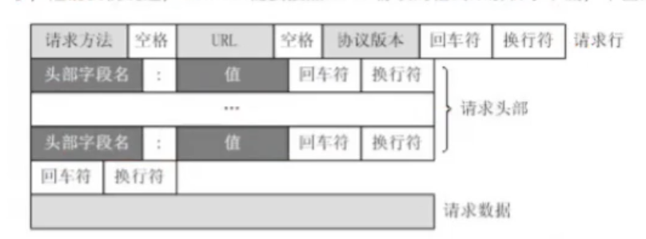

# Tomcat
[toc]

## 简述
tomcat为一个servlet容器

## 大体流程



## 容器介绍
### Engine
tomcat自带的集群功能，很少用，一般一个tomcat就一个engine，用来指定默认的host，就是defaultHost参数。
### Host
为Context上层的servlet容器，作为虚拟主机使用，可以配置多个虚拟主机，每个虚拟主机对应一个应用服务，例如tomcat server.xml中的默认Host配置，name为对应域名，appBase为当前应用存储地址，默认在webapps下。

例如我们有2个域名，一个手机，一个服装，我们都解析到当前机器下，对应接口分别为
- www.fuzhuang.com/user/getById
- www.shouji.com/user/getById

那么就会根据域名，到对应的context path，docBase中去寻找对应的资源`www.fuzhuang.com/user/getById`，name=`www.fuzhuang.com`，context为user


如果我们使用IP地址直接访问tomcat，Host无法找到对应的域名，会走到engine中的defaultHost参数

### Context
servlet容器，为具体应用，部署在webapps下的资源

### Wrapper
一个应用中，有许多的servlet，AServlet，BServlet，一个Wrapper对应一个servlet实例。在tomcat启动过程中，会针对AServlet生成一个Wrapper对象，BServlet生成一个对应BServlet的Wrapper对象。每个Servlet对应一个Wrapper。我们SpringMVC中用的DispatchServlet，不使用Wrapper，一个容器中只有一个DispatchServlet，所有的Servlet共享一个Servlet实例，所以Spring中的Servlet请求是线程不安全的，不能持有有状态的Servlet（不能在类中定义可变属性，会被其他Servlet修改）

- AServlet---》Wrapper--4个请求进入--》生成4个Servlet对象，放入Wrapper对象中

### 小结
Engine/Host/Context/Wrapper是层级结构，一个tomcat可以配置多个Engine，但是一般不用，一个Engine有多个Host，一个Host有多个Context，一个Context有多个Wrapper

- Engine ---> `List<Host>`
- Host ---> `List<Context>`
- Context ---> `List<Wrapper>`
- Wrapper ---> `List<Servlet>`


## Tomcat类关系

- CoyoteAdapter中有Connector属性，默认为HTTP/1.1，8080端口

- Connector中有Service属性，默认为StandardService
- StandardService挂Container属性
- Container有pipeline属性
- pipeline存valve


### Tomcat Container代码设计




## Tomcat如何处理一个请求？

### Adapter
根据收到的请求信息，生成request对象，找到该请求所对应的Host，Context，Wrapper，然后找到Engine的pipeline中的第一个valve执行
```java
    request = new Request();
    request.setHost(Host);
    request.setContext(Context);
    request.setWrapper(Wrapper);
    getEngine().getPipeline().getFristValve().invoke();
```
### Engine
执行Engine中的每个Valve，StrandEngineValve的作用是找到Host中的第一个valve
### Host
执行Host中的每个Valve，StrandHostValve的作用是找到Context中的第一个valve
### Context
执行Context中的每个Valve，StrandContextValve的作用是找到Wrapper中的第一个valve
### Wrapper
执行Wrapper中的每个Valve，StrandWrapperValve的作用是找到对应的Servlet实例，并调用service方法，直接调用Servlet具体方法



### 默认Valve与自定义Valve
### 自定义valve
```java
public class TestValve extends RequestFilterValve {
    @Override
    public void invoke(Request request, Response response) throws IOException, ServletException {
        System.out.println("Test valve");
        getNext().invoke(request,response);
    }

    @Override
    protected Log getLog() {
        return null;
    }
}
```

### 配置valve


## Tomcat将一个字节流的请求转成Request对象？
不同的IO模型只是表示从Socket上获取字节流的方式不同而已，而获取到字节流之后就要进行解析。之前我们说过，tomcat需要按照HTTP协议的格式来解析字节流。下面是HTTP协议格式：



浏览器或者HttpClient在发送数据时，需要按照HTTP协议来构造HTTP字符串，然后将字符串发送出去，所以Tomcat解析字节流的逻辑是：
- 从获得的第一个字节开始，遍历每个字节，当遇到空格时，那么之前所遍历到的字节数据就是请求方法
- 继续遍历每个字节，放遇到空格时候，那么之前遍历的字节数据就是URL。
- 继续便利每个字节，当遇到回车/换行时，那么之前遍历到的字节数据就是协议版本，并且表示请求行的遍历结束
- 继续便利每个字节，当遇到一个回车和换行的时候，那么所遍历的数据就是一个请求头
- 继续便利每个字节，当遍历到两个回车和换行的时候，那么所遍历的数据就是一个请求头，并且表示请求头全部遍历完毕
- 剩下的数据就是请求体

值得注意的是，如果使用的是长链接，那么就有可能多个HTTP请求共用一个Socket，多个HTTP请求是连在一起的，这时候Tomcat就需要发送者控制参数，帮助Tomcat区分多个不同的请求
- Header：Content-Length
- 请求体分块

## SpringBoot请求执行流程

在执行第一次请求到Spring Boot应用程序的时候，会通过Tomcat初始化Spring MVC相关组件。

### Adapter执行流程


### Valve执行流程


## Servlet#init初始化MVC组件

- MultipartResolver
- LocaleResolver
- ThemeResolver 
- HandlerMapping 


- HandlerAdapter 


- HandlerExceptionResolver 
- RequestToViewNameTranslator 
- ViewResolver 
- FlashMapManager

## Tomcat EndPoint设计


## 内嵌tomcat Spring mvc一次请求流程

```bash
@startuml
'https://plantuml.com/sequence-diagram

group 系统启动
    Connector->AbstractProtocol:start()
    AbstractProtocol->AbstractEndpoint:startInternal()
    AbstractEndpoint->NioEndpoint:startInternal()#创建Tomcat线程池启动Poller/Acceptor
    NioEndpoint->Poller:run()#启动Poller等待Acceptor存入事件
    NioEndpoint->Acceptor:run()#启动Acceptor阻塞等待接收客户端请求
end
group 接入请求Acceptor与Poller
    Acceptor-->Acceptor : run()#阻塞等待请求
    Acceptor->Nio2Endpoint : serverSocketAccept()#收到请求
    Nio2Endpoint->Acceptor : 获取到socket
    Acceptor->Poller : 往events中添加socketWrapper
    Poller-->Poller : 循环等待Acceptor往events中放事件，获取事件
    Poller->AbstractEndpoint : processSocket(socketWrapper,event,dispatch)#将socket任务放入线程池
    AbstractEndpoint--> SocketProcessorBase: run()
    SocketProcessorBase--> AbstractEndpoint.SocketProcessor: doRun()#接入请求开始初始化Request/Response
end

group 第一次接入且执行请求
    AbstractEndpoint.SocketProcessor->AbstractProtocol:process(socketWrapper, event)
    AbstractProtocol->AbstractProcessorLight:process(socketWrapper, event)
    AbstractProcessorLight->Http11Processor:service(socketWrapper)#组装Request/Response
    group 执行Adapter
    Http11Processor->CoyoteAdapter:service(request, response)#链接Connector/Container，构造Request/Response
    CoyoteAdapter->StandardEngineValve:invoke(request,response)
    end
    group 执行Valve
    StandardEngineValve->ErrorReportValve:invoke(request, response)
    ErrorReportValve->AuthenticatorBase:invoke(request, response)
    AuthenticatorBase->StandardContextValve:invoke(request, response)
    StandardContextValve->StandardWrapperValve:invoke(request, response)
    StandardWrapperValve->StandardWrapper:initServlet(instance)
    end
    group 初始化Servlet
    StandardWrapper->HttpServletBean:init()
    HttpServletBean->FrameworkServlet:initServletBean()
    FrameworkServlet->FrameworkServlet:initWebApplicationContext()
    FrameworkServlet->DispatcherServlet:onRefresh(ApplicationContext)#初始化SpringMVC Bean
    DispatcherServlet->StandardWrapperValve:返回初始化的Servlet
    end
    group request/response过滤器链
    StandardWrapperValve->ApplicationFilterFactory:添加4个ApplicationFilterChain
    ApplicationFilterFactory->ApplicationFilterChain:doFilter(request,response)
    ApplicationFilterChain->OncePerRequestFilter:doFilter(request,response)
    OncePerRequestFilter->CharacterEncodingFilter:doFilterInternal(httpRequest, httpResponse, filterChain)

    CharacterEncodingFilter->ApplicationFilterChain:doFilter(request,response)
    ApplicationFilterChain->OncePerRequestFilter:doFilter(request,response)
    OncePerRequestFilter->FormContentFilter:doFilterInternal(httpRequest, httpResponse, filterChain)

    FormContentFilter->ApplicationFilterChain:doFilter(request,response)
    ApplicationFilterChain->OncePerRequestFilter:doFilter(request,response)
    OncePerRequestFilter->RequestContextFilter:doFilterInternal(httpRequest, httpResponse, filterChain)

    RequestContextFilter->ApplicationFilterChain:doFilter(request,response)
    ApplicationFilterChain->OncePerRequestFilter:doFilter(request,response)
    OncePerRequestFilter->WsFilter:doFilterInternal(httpRequest, httpResponse, filterChain)

    WsFilter->ApplicationFilterChain:doFilter(request,response)
    note left :执行完过滤器开始分发请求
    end
    group 分发执行请求
    ApplicationFilterChain->FrameworkServlet:servlet.service(request, response)
    FrameworkServlet->HttpServlet:servlet.service(request, response)
    HttpServlet->FrameworkServlet:doGet()
    FrameworkServlet->DispatcherServlet:doService()
    DispatcherServlet->AbstractHandlerMethodAdapter:handle(processedRequest, response, mappedHandler.getHandler())
    AbstractHandlerMethodAdapter->ServletInvocableHandlerMethod:invokeAndHandle(webRequest, mavContainer)
    ServletInvocableHandlerMethod->InvocableHandlerMethod:doInvoke(Object... args)#反射执行请求
    end
    group 处理返回值
    InvocableHandlerMethod->ServletInvocableHandlerMethod:执行请求完成返回
    ServletInvocableHandlerMethod->HandlerMethodReturnValueHandlerComposite:处理返回值
    HandlerMethodReturnValueHandlerComposite->RequestResponseBodyMethodProcessor:处理返回值
    RequestResponseBodyMethodProcessor->AbstractMessageConverterMethodProcessor:((HttpMessageConverter) converter).write(body, selectedMediaType, outputMessage)
    AbstractMessageConverterMethodProcessor->AbstractHttpMessageConverter:((HttpMessageConverter) converter).write(body, selectedMediaType, outputMessage)
    end
end
@enduml
```

